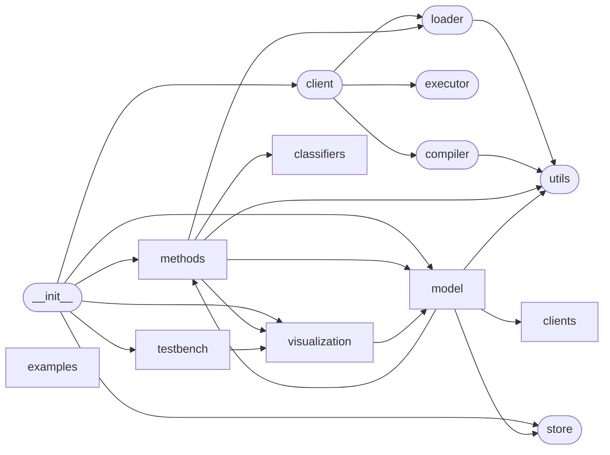

# Code Overview

[_Documentation generated by Documatic_](https://www.documatic.com)

<!---Documatic-section-Codebase Structure Python-start--->
## Codebase Structure Python

The codebase has a 2-deep folder structure,
                with 70 code files in total.

<!---Documatic-block-system_architecture-start--->

<!---Documatic-block-system_architecture-end--->

# #
<!---Documatic-section-Codebase Structure Python-end--->

<!---Documatic-section-Key Objects-start--->
## Key Objects

There are exposed imports at level-0
from the source directory (elfi)

<!---Documatic-block-elf-start--->

	
<code>elf</code> (Click to Expand!)

* `elfi.client.get_client`
* `elfi.client.set_client`
* `elfi.methods.bo.gpy_regression.GPyRegression`
* `elfi.methods.diagnostics.TwoStageSelection`
* `elfi.methods.inference.bolfi.BOLFI`
* `elfi.methods.inference.bolfi.BayesianOptimization`
* `elfi.methods.inference.bolfire.BOLFIRE`
* `elfi.methods.inference.bsl.BSL`
* `elfi.methods.inference.romc.ROMC`
* `elfi.methods.inference.samplers.AdaptiveDistanceSMC`
* `elfi.methods.inference.samplers.AdaptiveThresholdSMC`
* `elfi.methods.inference.samplers.Rejection`
* `elfi.methods.inference.samplers.SMC`
* `elfi.methods.model_selection.compare_models`
* `elfi.methods.post_processing.adjust_posterior`
* `elfi.model.elfi_model.AdaptiveDistance`
* `elfi.model.elfi_model.ComputationContext`
* `elfi.model.elfi_model.Constant`
* `elfi.model.elfi_model.Discrepancy`
* `elfi.model.elfi_model.Distance`
* `elfi.model.elfi_model.ElfiModel`
* `elfi.model.elfi_model.NodeReference`
* `elfi.model.elfi_model.Operation`
* `elfi.model.elfi_model.Prior`
* `elfi.model.elfi_model.RandomVariable`
* `elfi.model.elfi_model.Simulator`
* `elfi.model.elfi_model.Summary`
* `elfi.model.elfi_model.SyntheticLikelihood`
* `elfi.model.elfi_model.get_default_model`
* `elfi.model.elfi_model.load_model`
* `elfi.model.elfi_model.new_model`
* `elfi.model.elfi_model.set_default_model`
* `elfi.model.extensions.ScipyLikeDistribution`
* `elfi.store.ArrayPool`
* `elfi.store.OutputPool`
* `elfi.testbench.testbench.Testbench`
* `elfi.testbench.testbench.TestbenchMethod`
* `elfi.visualization.visualization.nx_draw`
* `elfi.visualization.visualization.plot_params_vs_node`
* `elfi.visualization.visualization.plot_predicted_summaries`

<!---Documatic-block-elf-end--->

# #
<!---Documatic-section-Key Objects-end--->

<!---Documatic-section-Important Functions-start--->
## Important Functions

<!---Documatic-block-important_funcs-start--->
<!---Documatic-block-most_used_funcs-start--->
### Most Utilised Functions

* [elfi.methods.utils.arr2d_to_batch](6-elfi_methods.md#elfi.methods.utils.arr2d_to_batch) (5 times)
* [elfi.utils.observed_name](3-elfi_utils.md#elfi.utils.observed_name) (3 times)
* elfi.loader.get_sub_seed (3 times)
* [elfi.methods.utils.batch_to_arr2d](6-elfi_methods.md#elfi.methods.utils.batch_to_arr2d) (3 times)
* [elfi.methods.utils.resolve_sigmas](6-elfi_methods.md#elfi.methods.utils.resolve_sigmas) (3 times)
* [elfi.utils.get_sub_seed](3-elfi_utils.md#elfi.utils.get_sub_seed) (2 times)
* [elfi.utils.args_to_tuple](3-elfi_utils.md#elfi.utils.args_to_tuple) (2 times)
* [elfi.methods.bo.utils.minimize](6-elfi_methods.md#elfi.methods.bo.utils.minimize) (2 times)
* [elfi.methods.utils.weighted_sample_quantile](6-elfi_methods.md#elfi.methods.utils.weighted_sample_quantile) (2 times)
* [elfi.utils.is_array](3-elfi_utils.md#elfi.utils.is_array) (2 times)
* [elfi.methods.bo.utils.stochastic_optimization](6-elfi_methods.md#elfi.methods.bo.utils.stochastic_optimization) (2 times)
* [elfi.methods.utils.ceil_to_batch_size](6-elfi_methods.md#elfi.methods.utils.ceil_to_batch_size) (2 times)
* [elfi.client.get_client](5-elfi_client.md#elfi.client.get_client) (1 times)
* [elfi.client.set_client](5-elfi_client.md#elfi.client.set_client) (1 times)
* [elfi.methods.model_selection.compare_models](6-elfi_methods.md#elfi.methods.model_selection.compare_models) (1 times)
* [elfi.methods.post_processing.adjust_posterior](6-elfi_methods.md#elfi.methods.post_processing.adjust_posterior) (1 times)
* [elfi.model.elfi_model.get_default_model](8-elfi_model.md#elfi.model.elfi_model.get_default_model) (1 times)
* [elfi.model.elfi_model.load_model](8-elfi_model.md#elfi.model.elfi_model.load_model) (1 times)
* [elfi.model.elfi_model.new_model](8-elfi_model.md#elfi.model.elfi_model.new_model) (1 times)
* [elfi.model.elfi_model.set_default_model](8-elfi_model.md#elfi.model.elfi_model.set_default_model) (1 times)
* [elfi.visualization.visualization.nx_draw](9-elfi_visualization.md#elfi.visualization.visualization.nx_draw) (1 times)
* [elfi.visualization.visualization.plot_params_vs_node](9-elfi_visualization.md#elfi.visualization.visualization.plot_params_vs_node) (1 times)
* [elfi.visualization.visualization.plot_predicted_summaries](9-elfi_visualization.md#elfi.visualization.visualization.plot_predicted_summaries) (1 times)
* [elfi.utils.nbunch_ancestors](3-elfi_utils.md#elfi.utils.nbunch_ancestors) (1 times)
* [elfi.methods.mcmc.eff_sample_size](6-elfi_methods.md#elfi.methods.mcmc.eff_sample_size) (1 times)
<!---Documatic-block-most_used_funcs-end--->

<!---Documatic-block-end_user_funcs-start--->
### End User Exposed Functions

* [elfi.model.elfi_model.ElfiModel](8-elfi_model.md#elfi.model.elfi_model.ElfiModel)
* [elfi.methods.inference.bolfi.BOLFI](6-elfi_methods.md#elfi.methods.inference.bolfi.BOLFI)
* [elfi.model.elfi_model.Summary](8-elfi_model.md#elfi.model.elfi_model.Summary)
* [elfi.model.elfi_model.get_default_model](8-elfi_model.md#elfi.model.elfi_model.get_default_model)
* [elfi.testbench.testbench.TestbenchMethod](7-elfi_testbench.md#elfi.testbench.testbench.TestbenchMethod)
* [elfi.methods.model_selection.compare_models](6-elfi_methods.md#elfi.methods.model_selection.compare_models)
* [elfi.methods.inference.bolfire.BOLFIRE](6-elfi_methods.md#elfi.methods.inference.bolfire.BOLFIRE)
* [elfi.model.elfi_model.ComputationContext](8-elfi_model.md#elfi.model.elfi_model.ComputationContext)
* [elfi.model.elfi_model.Simulator](8-elfi_model.md#elfi.model.elfi_model.Simulator)
* [elfi.visualization.visualization.plot_params_vs_node](9-elfi_visualization.md#elfi.visualization.visualization.plot_params_vs_node)
* [elfi.model.elfi_model.SyntheticLikelihood](8-elfi_model.md#elfi.model.elfi_model.SyntheticLikelihood)
* [elfi.methods.inference.samplers.AdaptiveDistanceSMC](6-elfi_methods.md#elfi.methods.inference.samplers.AdaptiveDistanceSMC)
* [elfi.methods.inference.samplers.AdaptiveThresholdSMC](6-elfi_methods.md#elfi.methods.inference.samplers.AdaptiveThresholdSMC)
* [elfi.methods.bo.gpy_regression.GPyRegression](6-elfi_methods.md#elfi.methods.bo.gpy_regression.GPyRegression)
* [elfi.model.elfi_model.Operation](8-elfi_model.md#elfi.model.elfi_model.Operation)
* [elfi.methods.inference.samplers.SMC](6-elfi_methods.md#elfi.methods.inference.samplers.SMC)
* [elfi.visualization.visualization.plot_predicted_summaries](9-elfi_visualization.md#elfi.visualization.visualization.plot_predicted_summaries)
* [elfi.client.get_client](5-elfi_client.md#elfi.client.get_client)
* [elfi.model.elfi_model.Prior](8-elfi_model.md#elfi.model.elfi_model.Prior)
* [elfi.visualization.visualization.nx_draw](9-elfi_visualization.md#elfi.visualization.visualization.nx_draw)
* [elfi.methods.post_processing.adjust_posterior](6-elfi_methods.md#elfi.methods.post_processing.adjust_posterior)
* [elfi.model.elfi_model.RandomVariable](8-elfi_model.md#elfi.model.elfi_model.RandomVariable)
* [elfi.store.ArrayPool](4-elfi_store.md#elfi.store.ArrayPool)
* [elfi.methods.inference.romc.ROMC](6-elfi_methods.md#elfi.methods.inference.romc.ROMC)
* [elfi.model.elfi_model.Constant](8-elfi_model.md#elfi.model.elfi_model.Constant)
* [elfi.store.OutputPool](4-elfi_store.md#elfi.store.OutputPool)
* [elfi.client.set_client](5-elfi_client.md#elfi.client.set_client)
* [elfi.methods.diagnostics.TwoStageSelection](6-elfi_methods.md#elfi.methods.diagnostics.TwoStageSelection)
* [elfi.model.extensions.ScipyLikeDistribution](8-elfi_model.md#elfi.model.extensions.ScipyLikeDistribution)
* [elfi.model.elfi_model.NodeReference](8-elfi_model.md#elfi.model.elfi_model.NodeReference)
* [elfi.methods.inference.bsl.BSL](6-elfi_methods.md#elfi.methods.inference.bsl.BSL)
* [elfi.methods.inference.samplers.Rejection](6-elfi_methods.md#elfi.methods.inference.samplers.Rejection)
* [elfi.model.elfi_model.new_model](8-elfi_model.md#elfi.model.elfi_model.new_model)
* [elfi.testbench.testbench.Testbench](7-elfi_testbench.md#elfi.testbench.testbench.Testbench)
* [elfi.model.elfi_model.Discrepancy](8-elfi_model.md#elfi.model.elfi_model.Discrepancy)
* [elfi.model.elfi_model.Distance](8-elfi_model.md#elfi.model.elfi_model.Distance)
* [elfi.model.elfi_model.load_model](8-elfi_model.md#elfi.model.elfi_model.load_model)
* [elfi.model.elfi_model.AdaptiveDistance](8-elfi_model.md#elfi.model.elfi_model.AdaptiveDistance)
* [elfi.model.elfi_model.set_default_model](8-elfi_model.md#elfi.model.elfi_model.set_default_model)
* [elfi.methods.inference.bolfi.BayesianOptimization](6-elfi_methods.md#elfi.methods.inference.bolfi.BayesianOptimization)
<!---Documatic-block-end_user_funcs-end--->
<!---Documatic-block-important_funcs-end--->

# #
<!---Documatic-section-Important Functions-end--->

<!---Documatic-section-File IO-start--->
## File IO

<!---Documatic-block-file_io-start--->
The following files have file read operations

<!---Documatic-block-elfi-start--->

	
<code>elfi</code> (Click to Expand!)

* elfi.store

<!---Documatic-block-elfi-end--->

<!---Documatic-block-elfi.examples-start--->

	
<code>elfi.examples</code> (Click to Expand!)

* elfi.examples.bdm

<!---Documatic-block-elfi.examples-end--->

<!---Documatic-block-elfi.model-start--->

	
<code>elfi.model</code> (Click to Expand!)

* elfi.model.elfi_model

<!---Documatic-block-elfi.model-end--->

The following files have file write operations

<!---Documatic-block-elfi-start--->

	
<code>elfi</code> (Click to Expand!)

* elfi.store

<!---Documatic-block-elfi-end--->

<!---Documatic-block-elfi.methods-start--->

	
<code>elfi.methods</code> (Click to Expand!)

* elfi.methods.results

<!---Documatic-block-elfi.methods-end--->

<!---Documatic-block-elfi.model-start--->

	
<code>elfi.model</code> (Click to Expand!)

* elfi.model.elfi_model

<!---Documatic-block-elfi.model-end--->
<!---Documatic-block-file_io-end--->

# #
<!---Documatic-section-File IO-end--->

<!---Documatic-section-Class Hierarchy-start--->
## Class Hierarchy

<!---Documatic-block-elfi.client.ClientBase-start--->

	
<code>elfi.client.ClientBase</code> (Click to Expand!)

* elfi.clients.dask.Client
* elfi.clients.ipyparallel.Client
* elfi.clients.multiprocessing.Client
* elfi.clients.native.Client

<!---Documatic-block-elfi.client.ClientBase-end--->

<!---Documatic-block-elfi.methods.inference.samplers.SMC-start--->

	
<code>elfi.methods.inference.samplers.SMC</code> (Click to Expand!)

* [elfi.methods.inference.samplers.AdaptiveDistanceSMC](6-elfi_methods.md#elfi.methods.inference.samplers.AdaptiveDistanceSMC)
* [elfi.methods.inference.samplers.AdaptiveThresholdSMC](6-elfi_methods.md#elfi.methods.inference.samplers.AdaptiveThresholdSMC)

<!---Documatic-block-elfi.methods.inference.samplers.SMC-end--->

<!---Documatic-block-elfi.model.elfi_model.Discrepancy-start--->

	
<code>elfi.model.elfi_model.Discrepancy</code> (Click to Expand!)

* [elfi.model.elfi_model.AdaptiveDistance](8-elfi_model.md#elfi.model.elfi_model.AdaptiveDistance)
* [elfi.model.elfi_model.Distance](8-elfi_model.md#elfi.model.elfi_model.Distance)

<!---Documatic-block-elfi.model.elfi_model.Discrepancy-end--->

<!---Documatic-block-elfi.model.elfi_model.NodeReference-start--->

	
<code>elfi.model.elfi_model.NodeReference</code> (Click to Expand!)

* [elfi.model.elfi_model.Discrepancy](8-elfi_model.md#elfi.model.elfi_model.Discrepancy)
* elfi.model.elfi_model.ObservableMixin
* elfi.model.elfi_model.StochasticMixin

<!---Documatic-block-elfi.model.elfi_model.NodeReference-end--->

<!---Documatic-block-elfi.model.elfi_model.ObservableMixin-start--->

	
<code>elfi.model.elfi_model.ObservableMixin</code> (Click to Expand!)

* [elfi.model.elfi_model.Simulator](8-elfi_model.md#elfi.model.elfi_model.Simulator)
* [elfi.model.elfi_model.Summary](8-elfi_model.md#elfi.model.elfi_model.Summary)

<!---Documatic-block-elfi.model.elfi_model.ObservableMixin-end--->

<!---Documatic-block-elfi.model.elfi_model.StochasticMixin-start--->

	
<code>elfi.model.elfi_model.StochasticMixin</code> (Click to Expand!)

* [elfi.model.elfi_model.RandomVariable](8-elfi_model.md#elfi.model.elfi_model.RandomVariable)
* [elfi.model.elfi_model.Simulator](8-elfi_model.md#elfi.model.elfi_model.Simulator)

<!---Documatic-block-elfi.model.elfi_model.StochasticMixin-end--->

# #
<!---Documatic-section-Class Hierarchy-end--->

[_Documentation generated by Documatic_](https://www.documatic.com)