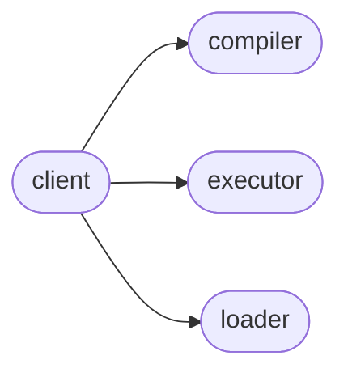

# Elfi Client

[_Documentation generated by Documatic_](https://www.documatic.com)

<!---Documatic-section-Codebase Structure-start--->
## Codebase Structure

<!---Documatic-block-system_architecture-start--->

<!---Documatic-block-system_architecture-end--->

# #
<!---Documatic-section-Codebase Structure-end--->

<!---Documatic-section-elfi.client.get_client-start--->
## [elfi.client.get_client](5-elfi_client.md#elfi.client.get_client)

<!---Documatic-section-get_client-start--->
<!---Documatic-block-elfi.client.get_client-start--->
<details>
	<summary><code>elfi.client.get_client</code> code snippet</summary>

```python
def get_client():
    global _client
    if _client is None:
        if _default_class is None:
            raise ValueError('Default client class is not defined')
        _client = _default_class()
    return _client
```
</details>
<!---Documatic-block-elfi.client.get_client-end--->
<!---Documatic-section-get_client-end--->

# #
<!---Documatic-section-elfi.client.get_client-end--->

<!---Documatic-section-elfi.client.set_client-start--->
## [elfi.client.set_client](5-elfi_client.md#elfi.client.set_client)

<!---Documatic-section-set_client-start--->
<!---Documatic-block-elfi.client.set_client-start--->
<details>
	<summary><code>elfi.client.set_client</code> code snippet</summary>

```python
def set_client(client=None, **kwargs):
    global _client
    if isinstance(client, str):
        m = importlib.import_module('elfi.clients.{}'.format(client))
        client = m.Client(**kwargs)
    _client = client
```
</details>
<!---Documatic-block-elfi.client.set_client-end--->
<!---Documatic-section-set_client-end--->

# #
<!---Documatic-section-elfi.client.set_client-end--->

[_Documentation generated by Documatic_](https://www.documatic.com)