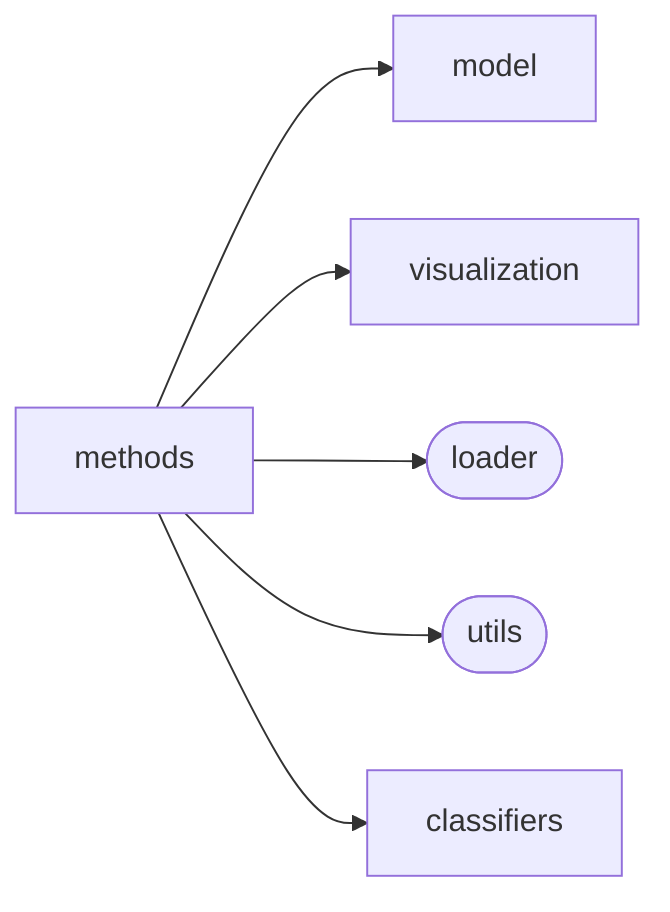

# Elfi Methods

[_Documentation generated by Documatic_](https://www.documatic.com)

<!---Documatic-section-Codebase Structure-start--->
## Codebase Structure

<!---Documatic-block-system_architecture-start--->

<!---Documatic-block-system_architecture-end--->

# #
<!---Documatic-section-Codebase Structure-end--->

<!---Documatic-section-elfi.methods.utils.arr2d_to_batch-start--->
## [elfi.methods.utils.arr2d_to_batch](6-elfi_methods.md#elfi.methods.utils.arr2d_to_batch)

<!---Documatic-section-arr2d_to_batch-start--->
<!---Documatic-block-elfi.methods.utils.arr2d_to_batch-start--->
<details>
	<summary><code>elfi.methods.utils.arr2d_to_batch</code> code snippet</summary>

```python
def arr2d_to_batch(x, names):
    try:
        x = x.reshape((-1, len(names)))
    except BaseException:
        raise ValueError('A dimension mismatch in converting array to batch dictionary. This may be caused by multidimensional prior nodes that are not yet supported.')
    batch = {p: x[:, i] for (i, p) in enumerate(names)}
    return batch
```
</details>
<!---Documatic-block-elfi.methods.utils.arr2d_to_batch-end--->
<!---Documatic-section-arr2d_to_batch-end--->

# #
<!---Documatic-section-elfi.methods.utils.arr2d_to_batch-end--->

<!---Documatic-section-elfi.methods.utils.batch_to_arr2d-start--->
## [elfi.methods.utils.batch_to_arr2d](6-elfi_methods.md#elfi.methods.utils.batch_to_arr2d)

<!---Documatic-section-batch_to_arr2d-start--->
<!---Documatic-block-elfi.methods.utils.batch_to_arr2d-start--->
<details>
	<summary><code>elfi.methods.utils.batch_to_arr2d</code> code snippet</summary>

```python
def batch_to_arr2d(batches, names):
    if not batches:
        return []
    if not isinstance(batches, list):
        batches = [batches]
    rows = []
    for batch_ in batches:
        rows.append(np.column_stack([batch_[n] for n in names]))
    return np.vstack(rows)
```
</details>
<!---Documatic-block-elfi.methods.utils.batch_to_arr2d-end--->
<!---Documatic-section-batch_to_arr2d-end--->

# #
<!---Documatic-section-elfi.methods.utils.batch_to_arr2d-end--->

<!---Documatic-section-elfi.methods.utils.resolve_sigmas-start--->
## [elfi.methods.utils.resolve_sigmas](6-elfi_methods.md#elfi.methods.utils.resolve_sigmas)

<!---Documatic-section-resolve_sigmas-start--->
<!---Documatic-block-elfi.methods.utils.resolve_sigmas-start--->
<details>
	<summary><code>elfi.methods.utils.resolve_sigmas</code> code snippet</summary>

```python
def resolve_sigmas(parameter_names: List[str], sigma_proposals: Optional[Dict]=None, bounds: Optional[Dict]=None) -> List:
    if sigma_proposals is None:
        sigma_proposals = []
        for bound in bounds:
            length_interval = bound[1] - bound[0]
            sigma_proposals.append(length_interval / 10)
    elif isinstance(sigma_proposals, dict):
        errmsg = "sigma_proposals' keys have to be identical to target_model.parameter_names."
        if len(sigma_proposals) is not len(parameter_names):
            raise ValueError(errmsg)
        try:
            sigma_proposals = [sigma_proposals[x] for x in parameter_names]
        except ValueError:
            print(parameter_names)
    else:
        raise ValueError('If provided, sigma_proposals need to be input as a dict.')
    return sigma_proposals
```
</details>
<!---Documatic-block-elfi.methods.utils.resolve_sigmas-end--->
<!---Documatic-section-resolve_sigmas-end--->

# #
<!---Documatic-section-elfi.methods.utils.resolve_sigmas-end--->

<!---Documatic-section-elfi.methods.bo.utils.minimize-start--->
## [elfi.methods.bo.utils.minimize](6-elfi_methods.md#elfi.methods.bo.utils.minimize)

<!---Documatic-section-minimize-start--->
<!---Documatic-block-elfi.methods.bo.utils.minimize-start--->
<details>
	<summary><code>elfi.methods.bo.utils.minimize</code> code snippet</summary>

```python
def minimize(fun, bounds, method='L-BFGS-B', constraints=None, grad=None, prior=None, n_start_points=10, maxiter=1000, random_state=None):
    ndim = len(bounds)
    start_points = np.empty((n_start_points, ndim))
    if prior is None:
        random_state = random_state or np.random
        for i in range(ndim):
            start_points[:, i] = random_state.uniform(*bounds[i], n_start_points)
    else:
        start_points = prior.rvs(n_start_points, random_state=random_state)
        if len(start_points.shape) == 1:
            start_points = start_points[:, None]
        for i in range(ndim):
            start_points[:, i] = np.clip(start_points[:, i], *bounds[i])
    locs = []
    vals = np.empty(n_start_points)
    for i in range(n_start_points):
        result = scipy.optimize.minimize(fun, start_points[i, :], method=method, jac=grad, bounds=bounds, constraints=constraints)
        locs.append(result['x'])
        vals[i] = result['fun']
    ind_min = np.argmin(vals)
    locs_out = locs[ind_min]
    for i in range(ndim):
        locs_out[i] = np.clip(locs_out[i], *bounds[i])
    return (locs[ind_min], vals[ind_min])
```
</details>
<!---Documatic-block-elfi.methods.bo.utils.minimize-end--->
<!---Documatic-section-minimize-end--->

# #
<!---Documatic-section-elfi.methods.bo.utils.minimize-end--->

<!---Documatic-section-elfi.methods.utils.weighted_sample_quantile-start--->
## [elfi.methods.utils.weighted_sample_quantile](6-elfi_methods.md#elfi.methods.utils.weighted_sample_quantile)

<!---Documatic-section-weighted_sample_quantile-start--->
<!---Documatic-block-elfi.methods.utils.weighted_sample_quantile-start--->
<details>
	<summary><code>elfi.methods.utils.weighted_sample_quantile</code> code snippet</summary>

```python
def weighted_sample_quantile(x, alpha, weights=None):
    index = np.argsort(x)
    if alpha == 0:
        alpha_q = x[index[0]]
    else:
        if weights is None:
            weights = np.ones(len(index))
        weights = weights / np.sum(weights)
        sorted_weights = weights[index]
        cum_weights = np.insert(np.cumsum(sorted_weights), 0, 0)
        cum_weights[-1] = 1.0
        index_alpha = np.where(np.logical_and(cum_weights[:-1] < alpha, alpha <= cum_weights[1:]))[0][0]
        alpha_q = x[index][index_alpha]
    return alpha_q
```
</details>
<!---Documatic-block-elfi.methods.utils.weighted_sample_quantile-end--->
<!---Documatic-section-weighted_sample_quantile-end--->

# #
<!---Documatic-section-elfi.methods.utils.weighted_sample_quantile-end--->

<!---Documatic-section-elfi.methods.bo.utils.stochastic_optimization-start--->
## [elfi.methods.bo.utils.stochastic_optimization](6-elfi_methods.md#elfi.methods.bo.utils.stochastic_optimization)

<!---Documatic-section-stochastic_optimization-start--->
<!---Documatic-block-elfi.methods.bo.utils.stochastic_optimization-start--->
<details>
	<summary><code>elfi.methods.bo.utils.stochastic_optimization</code> code snippet</summary>

```python
def stochastic_optimization(fun, bounds, maxiter=1000, polish=True, seed=0):

    def fun_1d(x):
        return fun(x).ravel()
    result = differential_evolution(func=fun_1d, bounds=bounds, maxiter=maxiter, polish=polish, init='latinhypercube', seed=seed)
    return (result.x, result.fun)
```
</details>
<!---Documatic-block-elfi.methods.bo.utils.stochastic_optimization-end--->
<!---Documatic-section-stochastic_optimization-end--->

# #
<!---Documatic-section-elfi.methods.bo.utils.stochastic_optimization-end--->

<!---Documatic-section-elfi.methods.utils.ceil_to_batch_size-start--->
## [elfi.methods.utils.ceil_to_batch_size](6-elfi_methods.md#elfi.methods.utils.ceil_to_batch_size)

<!---Documatic-section-ceil_to_batch_size-start--->
<!---Documatic-block-elfi.methods.utils.ceil_to_batch_size-start--->
<details>
	<summary><code>elfi.methods.utils.ceil_to_batch_size</code> code snippet</summary>

```python
def ceil_to_batch_size(num, batch_size):
    return int(batch_size * ceil(num / batch_size))
```
</details>
<!---Documatic-block-elfi.methods.utils.ceil_to_batch_size-end--->
<!---Documatic-section-ceil_to_batch_size-end--->

# #
<!---Documatic-section-elfi.methods.utils.ceil_to_batch_size-end--->

<!---Documatic-section-elfi.methods.model_selection.compare_models-start--->
## [elfi.methods.model_selection.compare_models](6-elfi_methods.md#elfi.methods.model_selection.compare_models)

<!---Documatic-section-compare_models-start--->
<!---Documatic-block-elfi.methods.model_selection.compare_models-start--->
<details>
	<summary><code>elfi.methods.model_selection.compare_models</code> code snippet</summary>

```python
def compare_models(sample_objs, model_priors=None):
    n_models = len(sample_objs)
    n_min = min([s.n_samples for s in sample_objs])
    try:
        discrepancies = np.concatenate([s.discrepancies for s in sample_objs])
    except ValueError:
        raise ValueError('All Sample objects must include valid discrepancies.')
    inds = np.argsort(discrepancies)[:n_min]
    p_models = np.empty(n_models)
    up_bound = 0
    for i in range(n_models):
        low_bound = up_bound
        up_bound += sample_objs[i].n_samples
        p_models[i] = np.logical_and(inds >= low_bound, inds < up_bound).sum()
        p_models[i] /= sample_objs[i].n_sim
        if model_priors is not None:
            p_models[i] *= model_priors[i]
    p_models = p_models / p_models.sum()
    return p_models
```
</details>
<!---Documatic-block-elfi.methods.model_selection.compare_models-end--->
<!---Documatic-section-compare_models-end--->

# #
<!---Documatic-section-elfi.methods.model_selection.compare_models-end--->

<!---Documatic-section-elfi.methods.post_processing.adjust_posterior-start--->
## [elfi.methods.post_processing.adjust_posterior](6-elfi_methods.md#elfi.methods.post_processing.adjust_posterior)

<!---Documatic-section-adjust_posterior-start--->


### Object Calls

* [elfi.methods.post_processing._get_adjustment](6-elfi_methods.md#elfi.methods.post_processing._get_adjustment)

<!---Documatic-block-elfi.methods.post_processing.adjust_posterior-start--->
<details>
	<summary><code>elfi.methods.post_processing.adjust_posterior</code> code snippet</summary>

```python
def adjust_posterior(sample, model, summary_names, parameter_names=None, adjustment='linear'):
    adjustment = _get_adjustment(adjustment)
    adjustment.fit(model=model, sample=sample, parameter_names=parameter_names, summary_names=summary_names)
    return adjustment.adjust()
```
</details>
<!---Documatic-block-elfi.methods.post_processing.adjust_posterior-end--->
<!---Documatic-section-adjust_posterior-end--->

# #
<!---Documatic-section-elfi.methods.post_processing.adjust_posterior-end--->

<!---Documatic-section-elfi.methods.mcmc.eff_sample_size-start--->
## [elfi.methods.mcmc.eff_sample_size](6-elfi_methods.md#elfi.methods.mcmc.eff_sample_size)

<!---Documatic-section-eff_sample_size-start--->
<!---Documatic-block-elfi.methods.mcmc.eff_sample_size-start--->
<details>
	<summary><code>elfi.methods.mcmc.eff_sample_size</code> code snippet</summary>

```python
def eff_sample_size(chains):
    chains = np.atleast_2d(chains)
    (n_chains, n_samples) = chains.shape
    means = np.mean(chains, axis=1)
    variances = np.var(chains, ddof=1, axis=1)
    var_between = 0 if n_chains == 1 else n_samples * np.var(means, ddof=1)
    var_within = np.mean(variances)
    var_pooled = ((n_samples - 1.0) * var_within + var_between) / n_samples
    n_padded = int(2 ** np.ceil(1 + np.log2(n_samples)))
    freqs = np.fft.rfft(chains - means[:, None], n_padded)
    autocov = np.fft.irfft(np.abs(freqs) ** 2)[:, :n_samples].real
    autocov = autocov / np.arange(n_samples, 0, -1)
    estimator_sum = 0.0
    lag = 1
    while lag < n_samples:
        temp = 1.0 - (var_within - np.mean(autocov[:, lag])) / var_pooled
        if temp >= 0:
            estimator_sum += temp
            lag += 1
        else:
            break
    ess = n_chains * n_samples / (1.0 + 2.0 * estimator_sum)
    return ess
```
</details>
<!---Documatic-block-elfi.methods.mcmc.eff_sample_size-end--->
<!---Documatic-section-eff_sample_size-end--->

# #
<!---Documatic-section-elfi.methods.mcmc.eff_sample_size-end--->

<!---Documatic-section-elfi.methods.inference.bolfi.BOLFI-start--->
## [elfi.methods.inference.bolfi.BOLFI](6-elfi_methods.md#elfi.methods.inference.bolfi.BOLFI)

<!---Documatic-section-BOLFI-start--->
<!---Documatic-block-elfi.methods.inference.bolfi.BOLFI-start--->
<details>
	<summary><code>elfi.methods.inference.bolfi.BOLFI</code> code snippet</summary>

```python
class BOLFI(BayesianOptimization):

    def fit(self, n_evidence, threshold=None, bar=True):
        """Fit the surrogate model.

        Generates a regression model for the discrepancy given the parameters.

        Currently only Gaussian processes are supported as surrogate models.

        Parameters
        ----------
        n_evidence : int, required
            Number of evidence for fitting
        threshold : float, optional
            Discrepancy threshold for creating the posterior (log with log discrepancy).
        bar : bool, optional
            Flag to remove (False) the progress bar from output.

        """
        logger.info('BOLFI: Fitting the surrogate model...')
        if n_evidence is None:
            raise ValueError('You must specify the number of evidence (n_evidence) for the fitting')
        self.infer(n_evidence, bar=bar)
        return self.extract_posterior(threshold)

    def extract_posterior(self, threshold=None):
        """Return an object representing the approximate posterior.

        The approximation is based on surrogate model regression.

        Parameters
        ----------
        threshold: float, optional
            Discrepancy threshold for creating the posterior (log with log discrepancy).

        Returns
        -------
        posterior : elfi.methods.posteriors.BolfiPosterior

        """
        if self.state['n_evidence'] == 0:
            raise ValueError('Model is not fitted yet, please see the `fit` method.')
        prior = ModelPrior(self.model, parameter_names=self.target_model.parameter_names)
        return BolfiPosterior(self.target_model, threshold=threshold, prior=prior)

    def sample(self, n_samples, warmup=None, n_chains=4, threshold=None, initials=None, algorithm='nuts', sigma_proposals=None, n_evidence=None, **kwargs):
        """Sample the posterior distribution of BOLFI.

        Here the likelihood is defined through the cumulative density function
        of the standard normal distribution:

        L(\\theta) \\propto F((h-\\mu(\\theta)) / \\sigma(\\theta))

        where h is the threshold, and \\mu(\\theta) and \\sigma(\\theta) are the posterior mean and
        (noisy) standard deviation of the associated Gaussian process.

        The sampling is performed with an MCMC sampler (the No-U-Turn Sampler, NUTS).

        Parameters
        ----------
        n_samples : int
            Number of requested samples from the posterior for each chain. This includes warmup,
            and note that the effective sample size is usually considerably smaller.
        warmpup : int, optional
            Length of warmup sequence in MCMC sampling. Defaults to n_samples//2.
        n_chains : int, optional
            Number of independent chains.
        threshold : float, optional
            The threshold (bandwidth) for posterior (give as log if log discrepancy).
        initials : np.array of shape (n_chains, n_params), optional
            Initial values for the sampled parameters for each chain.
            Defaults to best evidence points.
        algorithm : string, optional
            Sampling algorithm to use. Currently 'nuts'(default) and 'metropolis' are supported.
        sigma_proposals : dict, optional
            Standard deviations for Gaussian proposals of each parameter for Metropolis
            Markov Chain sampler. Defaults to 1/10 of surrogate model bound lengths.
        n_evidence : int
            If the regression model is not fitted yet, specify the amount of evidence

        Returns
        -------
        BolfiSample

        """
        if self.state['n_batches'] == 0:
            self.fit(n_evidence)
        if algorithm not in ['nuts', 'metropolis']:
            raise ValueError('Unknown posterior sampler.')
        posterior = self.extract_posterior(threshold)
        warmup = warmup or n_samples // 2
        if initials is not None:
            if np.asarray(initials).shape != (n_chains, self.target_model.input_dim):
                raise ValueError('The shape of initials must be (n_chains, n_params).')
        else:
            inds = np.argsort(self.target_model.Y[:, 0])
            initials = np.asarray(self.target_model.X[inds])
        self.target_model.is_sampling = True
        tasks_ids = []
        ii_initial = 0
        if algorithm == 'metropolis':
            sigma_proposals = resolve_sigmas(self.target_model.parameter_names, sigma_proposals, self.target_model.bounds)
        for ii in range(n_chains):
            seed = get_sub_seed(self.seed, ii)
            while np.isinf(posterior.logpdf(initials[ii_initial])):
                ii_initial += 1
                if ii_initial == len(inds):
                    raise ValueError('BOLFI.sample: Cannot find enough acceptable initialization points!')
            if algorithm == 'nuts':
                tasks_ids.append(self.client.apply(mcmc.nuts, n_samples, initials[ii_initial], posterior.logpdf, posterior.gradient_logpdf, n_adapt=warmup, seed=seed, **kwargs))
            elif algorithm == 'metropolis':
                tasks_ids.append(self.client.apply(mcmc.metropolis, n_samples, initials[ii_initial], posterior.logpdf, sigma_proposals, warmup, seed=seed, **kwargs))
            ii_initial += 1
        chains = []
        for id in tasks_ids:
            chains.append(self.client.get_result(id))
        chains = np.asarray(chains)
        print('{} chains of {} iterations acquired. Effective sample size and Rhat for each parameter:'.format(n_chains, n_samples))
        for (ii, node) in enumerate(self.target_model.parameter_names):
            print(node, mcmc.eff_sample_size(chains[:, :, ii]), mcmc.gelman_rubin_statistic(chains[:, :, ii]))
        self.target_model.is_sampling = False
        return BolfiSample(method_name='BOLFI', chains=chains, parameter_names=self.target_model.parameter_names, warmup=warmup, threshold=float(posterior.threshold), n_sim=self.state['n_evidence'], seed=self.seed)
```
</details>
<!---Documatic-block-elfi.methods.inference.bolfi.BOLFI-end--->
<!---Documatic-section-BOLFI-end--->

# #
<!---Documatic-section-elfi.methods.inference.bolfi.BOLFI-end--->

<!---Documatic-section-elfi.methods.inference.bolfire.BOLFIRE-start--->
## [elfi.methods.inference.bolfire.BOLFIRE](6-elfi_methods.md#elfi.methods.inference.bolfire.BOLFIRE)

<!---Documatic-section-BOLFIRE-start--->
<!---Documatic-block-elfi.methods.inference.bolfire.BOLFIRE-start--->
<details>
	<summary><code>elfi.methods.inference.bolfire.BOLFIRE</code> code snippet</summary>

```python
class BOLFIRE(ParameterInference):

    def __init__(self, model, n_training_data, feature_names=None, marginal=None, seed_marginal=None, classifier=None, bounds=None, n_initial_evidence=0, acq_noise_var=0, exploration_rate=10, update_interval=1, target_model=None, acquisition_method=None, *args, **kwargs):
        """Initialize the BOLFIRE method.

        Parameters
        ----------
        model: ElfiModel
            Elfi graph used by the algorithm.
        n_training_data: int
            Size of training data.
        feature_names: str or list, optional
            ElfiModel nodes used as features in classification. Default all Summary nodes.
        marginal: np.ndnarray, optional
            Marginal data.
        seed_marginal: int, optional
            Seed for marginal data generation.
        classifier: str, optional
            Classifier to be used. Default LogisticRegression.
        bounds: dict, optional
            The region where to estimate the posterior for each parameter in
            model.parameters: dict('parameter_name': (lower, upper), ... ). Not used if
            custom target_model is given.
        n_initial_evidence: int, optional
            Number of initial evidence.
        acq_noise_var : float or dict, optional
            Variance(s) of the noise added in the default LCBSC acquisition method.
            If a dictionary, values should be float specifying the variance for each dimension.
        exploration_rate: float, optional
            Exploration rate of the acquisition method.
        update_interval : int, optional
            How often to update the GP hyperparameters of the target_model.
        target_model: GPyRegression, optional
            A surrogate model to be used.
        acquisition_method: Acquisition, optional
            Method of acquiring evidence points. Default LCBSC.

        """
        model = self._resolve_model(model)
        super(BOLFIRE, self).__init__(model, *args, output_names=None, **kwargs)
        self.n_training_data = self._resolve_n_training_data(n_training_data)
        self.feature_names = self._resolve_feature_names(self.model, feature_names)
        self.marginal = self._resolve_marginal(marginal, seed_marginal)
        self.classifier = self._resolve_classifier(classifier)
        self.observed = self._get_observed_feature_values(self.model, self.feature_names)
        self.bounds = bounds
        self.acq_noise_var = acq_noise_var
        self.exploration_rate = exploration_rate
        self.update_interval = update_interval
        self.target_model = self._resolve_target_model(target_model)
        self.prior = ModelPrior(self.model, parameter_names=self.target_model.parameter_names)
        self.cost = CostFunction(self.prior.logpdf, self.prior.gradient_logpdf, scale=-1)
        self.n_initial_evidence = self._resolve_n_initial_evidence(n_initial_evidence)
        self.acquisition_method = self._resolve_acquisition_method(acquisition_method)
        self.state['n_evidence'] = 0
        self.state['last_GP_update'] = self.n_initial_evidence
        self.classifier_attributes = []
        self._likelihood = np.zeros((self.n_training_data, self.marginal.shape[1]))
        self._random_state = np.random.RandomState(self.seed)
        self._init_round()

    @property
    def n_evidence(self):
        """Return the number of acquired evidence points."""
        return self.state['n_evidence']

    def set_objective(self, n_evidence):
        """Set an objective for inference. You can continue BO by giving a larger n_evidence.

        Parameters
        ----------
        n_evidence: int
            Number of total evidence for the GP fitting. This includes any initial evidence.

        """
        if n_evidence < self.n_evidence:
            logger.warning('Requesting less evidence than there already exists.')
        self.objective['n_batches'] = n_evidence * int(self.n_training_data / self.batch_size)

    def extract_result(self):
        """Extract the results from the current state."""
        return BOLFIREPosterior(self.target_model.parameter_names, self.target_model, self.prior, self.classifier_attributes)

    def update(self, batch, batch_index):
        """Update the GP regression model of the target node with a new batch.

        Parameters
        ----------
        batch : dict
            dict with `self.outputs` as keys and the corresponding outputs for the batch
            as values
        batch_index : int
            Index of batch.

        """
        super(BOLFIRE, self).update(batch, batch_index)
        self._merge_batch(batch)
        if self._round_sim == self.n_training_data:
            self._update_logratio_model()
            self._init_round()

    def prepare_new_batch(self, batch_index):
        """Prepare values for a new batch.

        Parameters
        ----------
        batch_index: int

        Returns
        -------
        batch: dict

        """
        batch_parameters = np.repeat(self._params, self.batch_size, axis=0)
        return arr2d_to_batch(batch_parameters, self.target_model.parameter_names)

    def predict_log_ratio(self, X, y, X_obs):
        """Predict the log-ratio, i.e, logarithm of likelihood / marginal.

        Parameters
        ----------
        X: np.ndarray
            Training data features.
        y: np.ndarray
            Training data labels.
        X_obs: np.ndarray
            Observed data.

        Returns
        -------
        np.ndarray

        """
        self.classifier.fit(X, y)
        return self.classifier.predict_log_likelihood_ratio(X_obs)

    def fit(self, n_evidence, bar=True):
        """Fit the surrogate model.

        That is, generate a regression model for the negative posterior value given the parameters.
        Currently only GP regression are supported as surrogate models.

        Parameters
        ----------
        n_evidence: int
            Number of evidence for fitting.
        bar: bool, optional
            Flag to show or hide the progress bar during fit.

        Returns
        -------
        BOLFIREPosterior

        """
        logger.info('BOLFIRE: Fitting the surrogate model...')
        if isinstance(n_evidence, int) and n_evidence > 0:
            return self.infer(n_evidence, bar=bar)
        raise TypeError('n_evidence must be a positive integer.')

    def sample(self, n_samples, warmup=None, n_chains=4, initials=None, algorithm='nuts', sigma_proposals=None, n_evidence=None, *args, **kwargs):
        """Sample from the posterior distribution of BOLFIRE.

        Sampling is performed with an MCMC sampler.

        Parameters
        ----------
        n_samples: int
            Number of requested samples from the posterior for each chain. This includes warmup,
            and note that the effective sample size is usually considerably smaller.
        warmup: int, optional
            Length of warmup sequence in MCMC sampling.
        n_chains: int, optional
            Number of independent chains.
        initials: np.ndarray (n_chains, n_params), optional
            Initial values for the sampled parameters for each chain.
        algorithm: str, optional
            Sampling algorithm to use.
        sigma_proposals: np.ndarray
            Standard deviations for Gaussian proposals of each parameter for Metropolis-Hastings.
        n_evidence: int, optional
            If the surrogate model is not fitted yet, specify the amount of evidence.

        Returns
        -------
        BOLFIRESample

        """
        if self.state['n_batches'] == 0:
            self.fit(n_evidence)
        if algorithm not in ['nuts', 'metropolis']:
            raise ValueError('The given algorithm is not supported.')
        if algorithm == 'metropolis':
            sigma_proposals = resolve_sigmas(self.target_model.parameter_names, sigma_proposals, self.target_model.bounds)
        posterior = self.extract_result()
        warmup = warmup or n_samples // 2
        if initials is not None:
            if np.asarray(initials).shape != (n_chains, self.target_model.input_dim):
                raise ValueError('The shape of initials must be (n_chains, n_params).')
        else:
            inds = np.argsort(self.target_model.Y[:, 0])
            initials = np.asarray(self.target_model.X[inds])
        self.target_model.is_sampling = True
        tasks_ids = []
        ii_initial = 0
        for ii in range(n_chains):
            seed = get_sub_seed(self.seed, ii)
            while np.isinf(posterior.logpdf(initials[ii_initial])):
                ii_initial += 1
                if ii_initial == len(inds):
                    raise ValueError('BOLFIRE.sample: Cannot find enough acceptable initialization points!')
            if algorithm == 'nuts':
                tasks_ids.append(self.client.apply(mcmc.nuts, n_samples, initials[ii_initial], posterior.logpdf, posterior.gradient_logpdf, n_adapt=warmup, seed=seed, **kwargs))
            elif algorithm == 'metropolis':
                tasks_ids.append(self.client.apply(mcmc.metropolis, n_samples, initials[ii_initial], posterior.logpdf, sigma_proposals, warmup, seed=seed, **kwargs))
            ii_initial += 1
        chains = []
        for id in tasks_ids:
            chains.append(self.client.get_result(id))
        chains = np.asarray(chains)
        logger.info(f'{n_chains} chains of {n_samples} iterations acquired. Effective sample size and Rhat for each parameter:')
        for (ii, node) in enumerate(self.target_model.parameter_names):
            logger.info(f'{node} {mcmc.eff_sample_size(chains[:, :, ii])} {mcmc.gelman_rubin_statistic(chains[:, :, ii])}')
        self.target_model.is_sampling = False
        return BOLFIRESample(*args, method_name='BOLFIRE', chains=chains, parameter_names=self.target_model.parameter_names, warmup=warmup, n_sim=self.state['n_sim'], seed=self.seed, **kwargs)

    def _resolve_model(self, model):
        """Resolve a given elfi model."""
        if not isinstance(model, ElfiModel):
            raise ValueError('model must be an ElfiModel.')
        return model

    def _resolve_n_training_data(self, n_training_data):
        """Resolve the size of training data to be used."""
        if isinstance(n_training_data, int) and n_training_data > 0:
            if n_training_data % self.batch_size == 0:
                return n_training_data
            raise ValueError('n_training_data must be a multiple of batch_size.')
        raise TypeError('n_training_data must be a positive int.')

    def _resolve_feature_names(self, model, feature_names):
        """Resolve feature names to be used."""
        if feature_names is None:
            feature_names = self._get_summary_names(model)
            if len(feature_names) == 0:
                raise NotImplementedError('Could not resolve feature_names based on the model.')
            logger.info('Using all summary statistics as features in classification.')
            return feature_names
        if isinstance(feature_names, str):
            feature_names = [feature_names]
        if isinstance(feature_names, list):
            if len(feature_names) == 0:
                raise ValueError('feature_names must include at least one item.')
            for feature_name in feature_names:
                if feature_name not in model.nodes:
                    raise ValueError(f"Node '{feature_name}' not found in the model.")
                if not isinstance(model[feature_name], ObservableMixin):
                    raise TypeError(f"Node '{feature_name}' is not observable.")
            return feature_names
        raise TypeError('feature_names must be a string or a list of strings.')

    def _get_summary_names(self, model):
        """Return the names of summary statistics."""
        return [node for node in model.nodes if isinstance(model[node], Summary) and (not node.startswith('_'))]

    def _resolve_marginal(self, marginal, seed_marginal=None):
        """Resolve marginal data."""
        if marginal is None:
            marginal = self._generate_marginal(seed_marginal)
            (x, y) = marginal.shape
            logger.info(f'New marginal data ({x} x {y}) are generated.')
            return marginal
        if isinstance(marginal, np.ndarray) and len(marginal.shape) == 2:
            return marginal
        raise TypeError('marginal must be 2d numpy array.')

    def _generate_marginal(self, seed_marginal=None):
        """Generate marginal data."""
        batch = self.model.generate(self.n_training_data, outputs=self.feature_names, seed=seed_marginal)
        return batch_to_arr2d(batch, self.feature_names)

    def _resolve_classifier(self, classifier):
        """Resolve classifier."""
        if classifier is None:
            return LogisticRegression()
        if isinstance(classifier, Classifier):
            return classifier
        raise ValueError('classifier must be an instance of Classifier.')

    def _get_observed_feature_values(self, model, feature_names):
        """Return observed feature values."""
        return np.column_stack([model[feature_name].observed for feature_name in feature_names])

    def _resolve_n_initial_evidence(self, n_initial_evidence):
        """Resolve number of initial evidence."""
        if isinstance(n_initial_evidence, int) and n_initial_evidence >= 0:
            return n_initial_evidence
        raise ValueError('n_initial_evidence must be a non-negative integer.')

    def _resolve_target_model(self, target_model):
        """Resolve target model."""
        if target_model is None:
            return GPyRegression(self.model.parameter_names, self.bounds)
        if isinstance(target_model, GPyRegression):
            return target_model
        raise TypeError('target_model must be an instance of GPyRegression.')

    def _resolve_acquisition_method(self, acquisition_method):
        """Resolve acquisition method."""
        if acquisition_method is None:
            return LCBSC(model=self.target_model, prior=self.prior, noise_var=self.acq_noise_var, exploration_rate=self.exploration_rate, seed=self.seed, additive_cost=self.cost)
        if isinstance(acquisition_method, AcquisitionBase):
            return acquisition_method
        raise TypeError('acquisition_method must be an instance of AcquisitionBase.')

    def _init_round(self):
        """Initialize data collection round."""
        self._round_sim = 0
        if self.n_evidence < self.n_initial_evidence:
            self._params = self.prior.rvs(1, random_state=self._random_state)
        else:
            t = self.n_evidence - self.n_initial_evidence
            self._params = self.acquisition_method.acquire(1, t)

    def _new_round(self, batch_index):
        """Check whether batch_index starts a new data collection round."""
        return batch_index * self.batch_size % self.n_training_data == 0

    def _allow_submit(self, batch_index):
        """Check whether batch_index can be prepared."""
        if self._new_round(batch_index) and self.batches.has_pending:
            return False
        else:
            return super(BOLFIRE, self)._allow_submit(batch_index)

    def _merge_batch(self, batch):
        """Add batch to collected data."""
        data = batch_to_arr2d(batch, self.feature_names)
        self._likelihood[self._round_sim:self._round_sim + self.batch_size] = data
        self._round_sim += self.batch_size

    def _update_logratio_model(self):
        """Calculate log-ratio based on collected data and update surrogate model."""
        (X, y) = self._generate_training_data(self._likelihood, self.marginal)
        negative_log_ratio_value = -1 * self.predict_log_ratio(X, y, self.observed)
        self.classifier_attributes += [self.classifier.attributes]
        self.state['n_evidence'] += 1
        parameter_values = self._params
        optimize = self._should_optimize()
        self.target_model.update(parameter_values, negative_log_ratio_value, optimize)
        if optimize:
            self.state['last_GP_update'] = self.target_model.n_evidence

    def _generate_training_data(self, likelihood, marginal):
        """Generate training data."""
        X = np.vstack((likelihood, marginal))
        y = np.concatenate((np.ones(likelihood.shape[0]), -1 * np.ones(marginal.shape[0])))
        return (X, y)

    def _should_optimize(self):
        """Check whether GP hyperparameters should be optimized."""
        current = self.target_model.n_evidence + 1
        next_update = self.state['last_GP_update'] + self.update_interval
        return current >= self.n_initial_evidence and current >= next_update
```
</details>
<!---Documatic-block-elfi.methods.inference.bolfire.BOLFIRE-end--->
<!---Documatic-section-BOLFIRE-end--->

# #
<!---Documatic-section-elfi.methods.inference.bolfire.BOLFIRE-end--->

<!---Documatic-section-elfi.methods.inference.samplers.AdaptiveDistanceSMC-start--->
## [elfi.methods.inference.samplers.AdaptiveDistanceSMC](6-elfi_methods.md#elfi.methods.inference.samplers.AdaptiveDistanceSMC)

<!---Documatic-section-AdaptiveDistanceSMC-start--->
<!---Documatic-block-elfi.methods.inference.samplers.AdaptiveDistanceSMC-start--->
<details>
	<summary><code>elfi.methods.inference.samplers.AdaptiveDistanceSMC</code> code snippet</summary>

```python
class AdaptiveDistanceSMC(SMC):

    def __init__(self, model, discrepancy_name=None, output_names=None, **kwargs):
        """Initialize the adaptive distance SMC-ABC sampler.

        Parameters
        ----------
        model : ElfiModel or NodeReference
        discrepancy_name : str, NodeReference, optional
            Only needed if model is an ElfiModel
        output_names : list, optional
            Additional outputs from the model to be included in the inference result, e.g.
            corresponding summaries to the acquired samples
        kwargs:
            See ParameterInference

        """
        (model, discrepancy_name) = self._resolve_model(model, discrepancy_name)
        if not isinstance(model[discrepancy_name], AdaptiveDistance):
            raise TypeError('This method requires an adaptive distance node.')
        model[discrepancy_name].init_state()
        sums = [sumstat.name for sumstat in model[discrepancy_name].parents]
        if output_names is None:
            output_names = sums
        else:
            for k in sums:
                if k not in output_names:
                    output_names.append(k)
        super(AdaptiveDistanceSMC, self).__init__(model, discrepancy_name, output_names=output_names, **kwargs)

    def set_objective(self, n_samples, rounds, quantile=0.5):
        """Set objective for adaptive distance ABC-SMC inference.

        Parameters
        ----------
        n_samples : int
            Number of samples to generate
        rounds : int, optional
            Number of populations to sample
        quantile : float, optional
            Selection quantile used to determine sample thresholds

        """
        super(AdaptiveDistanceSMC, self).set_objective(ceil(n_samples / quantile), quantiles=[1] * rounds)
        self.population_size = n_samples
        self.quantile = quantile

    def _extract_population(self):
        rejection_sample = self._rejection.extract_result()
        outputs = dict()
        for k in self.output_names:
            outputs[k] = rejection_sample.outputs[k][:self.population_size]
        meta = rejection_sample.meta
        meta['adaptive_distance_w'] = self.model[self.discrepancy_name].state['w'][-1]
        meta['threshold'] = max(outputs[self.discrepancy_name])
        meta['accept_rate'] = self.population_size / meta['n_sim']
        method_name = 'Rejection within adaptive distance SMC-ABC'
        sample = Sample(method_name, outputs, self.parameter_names, **meta)
        (means, w, cov) = self._compute_weights_means_and_cov(sample)
        sample.means = means
        sample.weights = w
        sample.meta['cov'] = cov
        return sample

    def _extract_result_kwargs(self):
        kwargs = super(AdaptiveDistanceSMC, self)._extract_result_kwargs()
        kwargs['adaptive_distance_w'] = [pop.adaptive_distance_w for pop in self._populations]
        return kwargs

    def _set_threshold(self):
        round = self.state['round']
        self.objective['thresholds'][round] = self._populations[round - 1].threshold

    @property
    def current_population_threshold(self):
        """Return the threshold for current population."""
        return [np.inf] + [pop.threshold for pop in self._populations]
```
</details>
<!---Documatic-block-elfi.methods.inference.samplers.AdaptiveDistanceSMC-end--->
<!---Documatic-section-AdaptiveDistanceSMC-end--->

# #
<!---Documatic-section-elfi.methods.inference.samplers.AdaptiveDistanceSMC-end--->

<!---Documatic-section-elfi.methods.inference.samplers.AdaptiveThresholdSMC-start--->
## [elfi.methods.inference.samplers.AdaptiveThresholdSMC](6-elfi_methods.md#elfi.methods.inference.samplers.AdaptiveThresholdSMC)

<!---Documatic-section-AdaptiveThresholdSMC-start--->
<!---Documatic-block-elfi.methods.inference.samplers.AdaptiveThresholdSMC-start--->
<details>
	<summary><code>elfi.methods.inference.samplers.AdaptiveThresholdSMC</code> code snippet</summary>

```python
class AdaptiveThresholdSMC(SMC):

    def __init__(self, model, discrepancy_name=None, output_names=None, initial_quantile=0.2, q_threshold=0.99, densratio_estimation=None, **kwargs):
        """Initialize the adaptive threshold SMC-ABC sampler.

        Parameters
        ----------
        model : ElfiModel or NodeReference
        discrepancy_name : str, NodeReference, optional
            Only needed if model is an ElfiModel
        output_names : list, optional
            Additional outputs from the model to be included in the inference result, e.g.
            corresponding summaries to the acquired samples
        initial_quantile : float, optional
            Initial selection quantile for the first round of adaptive-ABC-SMC
        q_threshold : float, optional
            Termination criteratia for adaptive-ABC-SMC
        densratio_estimation : DensityRatioEstimation, optional
            Density ratio estimation object defining parameters for KLIEP
        kwargs:
            See ParameterInference

        """
        (model, discrepancy_name) = self._resolve_model(model, discrepancy_name)
        output_names = [discrepancy_name] + model.parameter_names + (output_names or [])
        super(SMC, self).__init__(model, output_names, **kwargs)
        self._prior = ModelPrior(self.model)
        self.discrepancy_name = discrepancy_name
        self.state['round'] = 0
        self._populations = []
        self._rejection = None
        self._round_random_state = None
        self.q_threshold = q_threshold
        self.initial_quantile = initial_quantile
        self.densratio = densratio_estimation or DensityRatioEstimation(n=100, epsilon=0.001, max_iter=200, abs_tol=0.01, fold=5, optimize=False)

    def set_objective(self, n_samples, max_iter=10):
        """Set objective for ABC-SMC inference.

        Parameters
        ----------
        n_samples : int
            Number of samples to generate
        thresholds : list, optional
            List of thresholds for ABC-SMC
        max_iter : int, optional
            Maximum number of iterations

        """
        rounds = max_iter - 1
        self.state['round'] = len(self._populations)
        rounds = rounds + self.state['round']
        thresholds = np.full(rounds + 1, None)
        self._quantiles = np.full(rounds + 1, None)
        self._quantiles[0] = self.initial_quantile
        self.objective.update(dict(n_samples=n_samples, n_batches=self.max_parallel_batches, round=rounds, thresholds=thresholds))
        self._init_new_round()
        self._update_objective()

    def update(self, batch, batch_index):
        """Update the inference state with a new batch.

        Parameters
        ----------
        batch : dict
            dict with `self.outputs` as keys and the corresponding outputs for the batch
            as values
        batch_index : int

        """
        super(SMC, self).update(batch, batch_index)
        self._rejection.update(batch, batch_index)
        if self._rejection.finished:
            self.batches.cancel_pending()
            if self.bar:
                self.progress_bar.update_progressbar(self.progress_bar.scaling + 1, self.progress_bar.scaling + 1)
            self._new_population = self._extract_population()
            if self.state['round'] < self.objective['round']:
                self._set_adaptive_quantile()
                if self._quantiles[self.state['round'] + 1] < self.q_threshold:
                    self._populations.append(self._new_population)
                    self.state['round'] += 1
                    self._init_new_round()
        self._update_objective()

    def _set_adaptive_quantile(self):
        """Set adaptively the new threshold for current population."""
        logger.info('ABC-SMC: Adapting quantile threshold...')
        sample_data_current = self._resolve_sample(backwards_index=0)
        sample_data_previous = self._resolve_sample(backwards_index=-1)
        if self.densratio.optimize:
            sigma = list(10.0 ** np.arange(-1, 6))
        else:
            sigma = calculate_densratio_basis_sigma(sample_data_current['sigma_max'], sample_data_previous['sigma_max'])
        self.densratio.fit(x=sample_data_current['samples'], y=sample_data_previous['samples'], weights_x=sample_data_current['weights'], weights_y=sample_data_previous['weights'], sigma=sigma)
        max_value = self.densratio.max_ratio()
        max_value = 1.0 if max_value < 1.0 else max_value
        self._quantiles[self.state['round'] + 1] = max(1 / max_value, 0.05)
        logger.info('ABC-SMC: Estimated maximum density ratio %.5f' % (1 / max_value))

    def _resolve_sample(self, backwards_index):
        """Get properties of the samples used in ratio estimation."""
        if self.state['round'] + backwards_index < 0:
            return self._densityratio_initial_sample()
        elif backwards_index == 0:
            sample = self._new_population
        else:
            sample = self._populations[backwards_index]
        weights = sample.weights
        samples = sample.samples_array
        sample_sigma = np.sqrt(np.diag(sample.cov))
        sigma_max = np.min(sample_sigma)
        sample_data = dict(samples=samples, weights=weights, sigma_max=sigma_max)
        return sample_data

    def _densityratio_initial_sample(self):
        n_samples = self._new_population.weights.shape[0]
        samples = self._prior.rvs(size=n_samples, random_state=self._round_random_state)
        weights = np.ones(n_samples)
        sample_cov = np.atleast_2d(np.cov(samples.reshape(n_samples, -1), rowvar=False))
        sigma_max = np.min(np.sqrt(np.diag(sample_cov)))
        return dict(samples=samples, weights=weights, sigma_max=sigma_max)
```
</details>
<!---Documatic-block-elfi.methods.inference.samplers.AdaptiveThresholdSMC-end--->
<!---Documatic-section-AdaptiveThresholdSMC-end--->

# #
<!---Documatic-section-elfi.methods.inference.samplers.AdaptiveThresholdSMC-end--->

<!---Documatic-section-elfi.methods.bo.gpy_regression.GPyRegression-start--->
## [elfi.methods.bo.gpy_regression.GPyRegression](6-elfi_methods.md#elfi.methods.bo.gpy_regression.GPyRegression)

<!---Documatic-section-GPyRegression-start--->
<!---Documatic-block-elfi.methods.bo.gpy_regression.GPyRegression-start--->
<details>
	<summary><code>elfi.methods.bo.gpy_regression.GPyRegression</code> code snippet</summary>

```python
class GPyRegression:

    def __init__(self, parameter_names=None, bounds=None, optimizer='scg', max_opt_iters=50, gp=None, **gp_params):
        """Initialize GPyRegression.

        Parameters
        ----------
        parameter_names : list of str, optional
            Names of parameter nodes. If None, sets dimension to 1.
        bounds : dict, optional
            The region where to estimate the posterior for each parameter in
            model.parameters.
            `{'parameter_name':(lower, upper), ... }`
            If not supplied, defaults to (0, 1) bounds for all dimensions.
        optimizer : string, optional
            Optimizer for the GP hyper parameters
            Alternatives: "scg", "fmin_tnc", "simplex", "lbfgsb", "lbfgs", "sgd"
            See also: paramz.Model.optimize()
        max_opt_iters : int, optional
        gp : GPy.model.GPRegression instance, optional
        **gp_params
            kernel : GPy.Kern
            noise_var : float
            mean_function

        """
        if parameter_names is None:
            input_dim = 1
        elif isinstance(parameter_names, (list, tuple)):
            input_dim = len(parameter_names)
        else:
            raise ValueError('Keyword `parameter_names` must be a list of strings')
        if bounds is None:
            logger.warning('Parameter bounds not specified. Using [0,1] for each parameter.')
            bounds = [(0, 1)] * input_dim
        elif len(bounds) != input_dim:
            raise ValueError('Length of `bounds` ({}) does not match the length of `parameter_names` ({}).'.format(len(bounds), input_dim))
        elif isinstance(bounds, dict):
            if len(bounds) == 1:
                bounds = [bounds[n] for n in bounds.keys()]
            else:
                bounds = [bounds[n] for n in parameter_names]
        else:
            raise ValueError("Keyword `bounds` must be a dictionary `{'parameter_name': (lower, upper), ... }`")
        self.parameter_names = parameter_names
        self.input_dim = input_dim
        self.bounds = bounds
        self.gp_params = gp_params
        self.optimizer = optimizer
        self.max_opt_iters = max_opt_iters
        self._gp = gp
        self._rbf_is_cached = False
        self.is_sampling = False

    def __str__(self):
        """Return GPy's __str__."""
        return self._gp.__str__()

    def __repr__(self):
        """Return GPy's __str__."""
        return self.__str__()

    def predict(self, x, noiseless=False):
        """Return the GP model mean and variance at x.

        Parameters
        ----------
        x : np.array
            numpy compatible (n, input_dim) array of points to evaluate
            if len(x.shape) == 1 will be cast to 2D with x[None, :]
        noiseless : bool
            whether to include the noise variance or not to the returned variance

        Returns
        -------
        tuple
            GP (mean, var) at x where
                mean : np.array
                    with shape (x.shape[0], 1)
                var : np.array
                    with shape (x.shape[0], 1)

        """
        x = np.asanyarray(x).reshape((-1, self.input_dim))
        if self._gp is None:
            return (np.zeros((x.shape[0], 1)), np.ones((x.shape[0], 1)))
        if self.is_sampling and self._kernel_is_default:
            if not self._rbf_is_cached:
                self._cache_RBF_kernel()
            r2 = np.sum(x ** 2.0, 1)[:, None] + self._rbf_x2sum - 2.0 * x.dot(self._gp.X.T)
            kx = self._rbf_var * np.exp(r2 * self._rbf_factor) + self._rbf_bias
            mu = kx.dot(self._rbf_woodbury)
            var = self._rbf_var + self._rbf_bias
            var -= kx.dot(self._rbf_woodbury_inv.dot(kx.T))
            var += self._rbf_noisevar
            return (mu, var)
        else:
            self._rbf_is_cached = False
        if noiseless:
            return self._gp.predict_noiseless(x)
        else:
            return self._gp.predict(x)

    def _cache_RBF_kernel(self):
        self._rbf_var = float(self._gp.kern.rbf.variance)
        self._rbf_factor = -0.5 / float(self._gp.kern.rbf.lengthscale) ** 2
        self._rbf_bias = float(self._gp.kern.bias.K(self._gp.X)[0, 0])
        self._rbf_noisevar = float(self._gp.likelihood.variance[0])
        self._rbf_woodbury = self._gp.posterior.woodbury_vector
        self._rbf_woodbury_inv = self._gp.posterior.woodbury_inv
        self._rbf_woodbury_chol = self._gp.posterior.woodbury_chol
        self._rbf_x2sum = np.sum(self._gp.X ** 2.0, 1)[None, :]
        self._rbf_is_cached = True

    def predict_mean(self, x):
        """Return the GP model mean function at x.

        Parameters
        ----------
        x : np.array
            numpy compatible (n, input_dim) array of points to evaluate
            if len(x.shape) == 1 will be cast to 2D with x[None, :]

        Returns
        -------
        np.array
            with shape (x.shape[0], 1)

        """
        return self.predict(x)[0]

    def predictive_gradients(self, x):
        """Return the gradients of the GP model mean and variance at x.

        Parameters
        ----------
        x : np.array
            numpy compatible (n, input_dim) array of points to evaluate
            if len(x.shape) == 1 will be cast to 2D with x[None, :]

        Returns
        -------
        tuple
            GP (grad_mean, grad_var) at x where
                grad_mean : np.array
                    with shape (x.shape[0], input_dim)
                grad_var : np.array
                    with shape (x.shape[0], input_dim)

        """
        x = np.asanyarray(x).reshape((-1, self.input_dim))
        if self._gp is None:
            return (np.zeros((x.shape[0], self.input_dim)), np.zeros((x.shape[0], self.input_dim)))
        if self.is_sampling and self._kernel_is_default:
            if not self._rbf_is_cached:
                self._cache_RBF_kernel()
            r2 = np.sum(x ** 2.0, 1)[:, None] + self._rbf_x2sum - 2.0 * x.dot(self._gp.X.T)
            kx = self._rbf_var * np.exp(r2 * self._rbf_factor)
            dkdx = 2.0 * self._rbf_factor * (x - self._gp.X) * kx.T
            grad_mu = dkdx.T.dot(self._rbf_woodbury).T
            v = np.linalg.solve(self._rbf_woodbury_chol, kx.T + self._rbf_bias)
            dvdx = np.linalg.solve(self._rbf_woodbury_chol, dkdx)
            grad_var = -2.0 * dvdx.T.dot(v).T
        else:
            (grad_mu, grad_var) = self._gp.predictive_gradients(x)
            grad_mu = grad_mu[:, :, 0]
        return (grad_mu, grad_var)

    def predictive_gradient_mean(self, x):
        """Return the gradient of the GP model mean at x.

        Parameters
        ----------
        x : np.array
            numpy compatible (n, input_dim) array of points to evaluate
            if len(x.shape) == 1 will be cast to 2D with x[None, :]

        Returns
        -------
        np.array
            with shape (x.shape[0], input_dim)

        """
        return self.predictive_gradients(x)[0]

    def _init_gp(self, x, y):
        self._kernel_is_default = False
        if self.gp_params.get('kernel') is None:
            kernel = self._default_kernel(x, y)
            if self.gp_params.get('noise_var') is None and self.gp_params.get('mean_function') is None:
                self._kernel_is_default = True
        else:
            kernel = self.gp_params.get('kernel')
        noise_var = self.gp_params.get('noise_var') or np.max(y) ** 2.0 / 100.0
        mean_function = self.gp_params.get('mean_function')
        self._gp = self._make_gpy_instance(x, y, kernel=kernel, noise_var=noise_var, mean_function=mean_function)

    def _default_kernel(self, x, y):
        length_scale = (np.max(self.bounds) - np.min(self.bounds)) / 3.0
        kernel_var = (np.max(y) / 3.0) ** 2.0
        bias_var = kernel_var / 4.0
        kernel = GPy.kern.RBF(input_dim=self.input_dim)
        kernel.lengthscale.set_prior(GPy.priors.Gamma.from_EV(length_scale, length_scale), warning=False)
        kernel.variance.set_prior(GPy.priors.Gamma.from_EV(kernel_var, kernel_var), warning=False)
        if 'mean_function' not in self.gp_params:
            bias = GPy.kern.Bias(input_dim=self.input_dim)
            bias.set_prior(GPy.priors.Gamma.from_EV(bias_var, bias_var), warning=False)
            kernel += bias
        return kernel

    def _make_gpy_instance(self, x, y, kernel, noise_var, mean_function):
        return GPy.models.GPRegression(X=x, Y=y, kernel=kernel, noise_var=noise_var, mean_function=mean_function)

    def update(self, x, y, optimize=False):
        """Update the GP model with new data.

        Parameters
        ----------
        x : np.array
        y : np.array
        optimize : bool, optional
            Whether to optimize hyperparameters.

        """
        x = x.reshape((-1, self.input_dim))
        y = y.reshape((-1, 1))
        if self._gp is None:
            self._init_gp(x, y)
        else:
            x = np.r_[self._gp.X, x]
            y = np.r_[self._gp.Y, y]
            kernel = self._gp.kern.copy() if self._gp.kern else None
            noise_var = self._gp.Gaussian_noise.variance[0]
            mean_function = self._gp.mean_function.copy() if self._gp.mean_function else None
            self._gp = self._make_gpy_instance(x, y, kernel=kernel, noise_var=noise_var, mean_function=mean_function)
        if optimize:
            self.optimize()

    def optimize(self):
        """Optimize GP hyperparameters."""
        logger.debug('Optimizing GP hyperparameters')
        try:
            self._gp.optimize(self.optimizer, max_iters=self.max_opt_iters)
        except np.linalg.linalg.LinAlgError:
            logger.warning('Numerical error in GP optimization. Stopping optimization')

    @property
    def n_evidence(self):
        """Return the number of observed samples."""
        if self._gp is None:
            return 0
        return self._gp.num_data

    @property
    def X(self):
        """Return input evidence."""
        return self._gp.X

    @property
    def Y(self):
        """Return output evidence."""
        return self._gp.Y

    @property
    def noise(self):
        """Return the noise."""
        return self._gp.Gaussian_noise.variance[0]

    @property
    def instance(self):
        """Return the gp instance."""
        return self._gp

    def copy(self):
        """Return a copy of current instance."""
        kopy = copy.copy(self)
        if self._gp:
            kopy._gp = self._gp.copy()
        if 'kernel' in self.gp_params:
            kopy.gp_params['kernel'] = self.gp_params['kernel'].copy()
        if 'mean_function' in self.gp_params:
            kopy.gp_params['mean_function'] = self.gp_params['mean_function'].copy()
        return kopy

    def __copy__(self):
        """Return a copy of current instance."""
        return self.copy()
```
</details>
<!---Documatic-block-elfi.methods.bo.gpy_regression.GPyRegression-end--->
<!---Documatic-section-GPyRegression-end--->

# #
<!---Documatic-section-elfi.methods.bo.gpy_regression.GPyRegression-end--->

<!---Documatic-section-elfi.methods.inference.samplers.SMC-start--->
## [elfi.methods.inference.samplers.SMC](6-elfi_methods.md#elfi.methods.inference.samplers.SMC)

<!---Documatic-section-SMC-start--->
<!---Documatic-block-elfi.methods.inference.samplers.SMC-start--->
<details>
	<summary><code>elfi.methods.inference.samplers.SMC</code> code snippet</summary>

```python
class SMC(Sampler):

    def __init__(self, model, discrepancy_name=None, output_names=None, **kwargs):
        """Initialize the SMC-ABC sampler.

        Parameters
        ----------
        model : ElfiModel or NodeReference
        discrepancy_name : str, NodeReference, optional
            Only needed if model is an ElfiModel
        output_names : list, optional
            Additional outputs from the model to be included in the inference result, e.g.
            corresponding summaries to the acquired samples
        kwargs:
            See ParameterInference

        """
        (model, discrepancy_name) = self._resolve_model(model, discrepancy_name)
        output_names = [discrepancy_name] + model.parameter_names + (output_names or [])
        super(SMC, self).__init__(model, output_names, **kwargs)
        self._prior = ModelPrior(self.model)
        self.discrepancy_name = discrepancy_name
        self.state['round'] = 0
        self._populations = []
        self._rejection = None
        self._round_random_state = None
        self._quantiles = None

    def set_objective(self, n_samples, thresholds=None, quantiles=None):
        """Set objective for ABC-SMC inference.

        Parameters
        ----------
        n_samples : int
            Number of samples to generate
        thresholds : list, optional
            List of thresholds for ABC-SMC
        quantiles : list, optional
            List of selection quantiles used to determine sample thresholds

        """
        if thresholds is None and quantiles is None:
            raise ValueError('Either thresholds or quantiles is required to run ABC-SMC.')
        if thresholds is None:
            rounds = len(quantiles) - 1
        else:
            rounds = len(thresholds) - 1
        self.state['round'] = len(self._populations)
        rounds = rounds + self.state['round']
        if thresholds is None:
            thresholds = np.full(rounds + 1, None)
            self._quantiles = np.concatenate((np.full(self.state['round'], None), quantiles))
        else:
            thresholds = np.concatenate((np.full(self.state['round'], None), thresholds))
        self.objective.update(dict(n_samples=n_samples, n_batches=self.max_parallel_batches, round=rounds, thresholds=thresholds))
        self._init_new_round()
        self._update_objective()

    def extract_result(self):
        """Extract the result from the current state.

        Returns
        -------
        SmcSample

        """
        pop = self._extract_population()
        self._populations.append(pop)
        return SmcSample(outputs=pop.outputs, populations=self._populations.copy(), weights=pop.weights, threshold=pop.threshold, **self._extract_result_kwargs())

    def update(self, batch, batch_index):
        """Update the inference state with a new batch.

        Parameters
        ----------
        batch : dict
            dict with `self.outputs` as keys and the corresponding outputs for the batch
            as values
        batch_index : int

        """
        super(SMC, self).update(batch, batch_index)
        self._rejection.update(batch, batch_index)
        if self._rejection.finished:
            self.batches.cancel_pending()
            if self.bar:
                self.progress_bar.update_progressbar(self.progress_bar.scaling + 1, self.progress_bar.scaling + 1)
            if self.state['round'] < self.objective['round']:
                self._populations.append(self._extract_population())
                self.state['round'] += 1
                self._init_new_round()
        self._update_objective()

    def prepare_new_batch(self, batch_index):
        """Prepare values for a new batch.

        Parameters
        ----------
        batch_index : int
            next batch_index to be submitted

        Returns
        -------
        batch : dict or None
            Keys should match to node names in the model. These values will override any
            default values or operations in those nodes.

        """
        if self.state['round'] == 0:
            return
        params = GMDistribution.rvs(*self._gm_params, size=self.batch_size, prior_logpdf=self._prior.logpdf, random_state=self._round_random_state)
        batch = arr2d_to_batch(params, self.parameter_names)
        return batch

    def _init_new_round(self):
        self._set_rejection_round(self.state['round'])
        if self.state['round'] == 0 and self._quantiles is not None:
            self._rejection.set_objective(self.objective['n_samples'], quantile=self._quantiles[0])
        else:
            if self._quantiles is not None:
                self._set_threshold()
            self._rejection.set_objective(self.objective['n_samples'], threshold=self.current_population_threshold)

    def _set_rejection_round(self, round):
        self._update_round_info(self.state['round'])
        seed = self.seed if round == 0 else get_sub_seed(self.seed, round)
        self._round_random_state = np.random.RandomState(seed)
        self._rejection = Rejection(self.model, discrepancy_name=self.discrepancy_name, output_names=self.output_names, batch_size=self.batch_size, seed=seed, max_parallel_batches=self.max_parallel_batches)

    def _update_round_info(self, round):
        if self.bar:
            reinit_msg = 'ABC-SMC Round {0} / {1}'.format(round + 1, self.objective['round'] + 1)
            self.progress_bar.reinit_progressbar(scaling=self.state['n_batches'], reinit_msg=reinit_msg)
        dashes = '-' * 16
        logger.info('%s Starting round %d %s' % (dashes, round, dashes))

    def _extract_population(self):
        sample = self._rejection.extract_result()
        sample.method_name = 'Rejection within SMC-ABC'
        (means, w, cov) = self._compute_weights_means_and_cov(sample)
        sample.means = means
        sample.weights = w
        sample.meta['cov'] = cov
        return sample

    def _compute_weights_means_and_cov(self, pop):
        params = np.column_stack(tuple([pop.outputs[p] for p in self.parameter_names]))
        if self._populations:
            q_logpdf = GMDistribution.logpdf(params, *self._gm_params)
            p_logpdf = self._prior.logpdf(params)
            w = np.exp(p_logpdf - q_logpdf)
        else:
            w = np.ones(pop.n_samples)
        means = params.copy()
        if np.count_nonzero(w) == 0:
            raise RuntimeError('All sample weights are zero. If you are using a prior with a bounded support, this may be caused by specifying a too small sample size.')
        cov = 2 * np.diag(weighted_var(params, w))
        if not np.all(np.isfinite(cov)):
            logger.warning('Could not estimate the sample covariance. This is often caused by majority of the sample weights becoming zero.Falling back to using unit covariance.')
            cov = np.diag(np.ones(params.shape[1]))
        return (means, w, cov)

    def _update_objective(self):
        """Update the objective n_batches."""
        n_batches = sum([pop.n_batches for pop in self._populations])
        self.objective['n_batches'] = n_batches + self._rejection.objective['n_batches']

    def _set_threshold(self):
        previous_population = self._populations[self.state['round'] - 1]
        threshold = weighted_sample_quantile(x=previous_population.discrepancies, alpha=self._quantiles[self.state['round']], weights=previous_population.weights)
        logger.info('ABC-SMC: Selected threshold for next population %.3f' % threshold)
        self.objective['thresholds'][self.state['round']] = threshold

    @property
    def _gm_params(self):
        sample = self._populations[-1]
        return (sample.means, sample.cov, sample.weights)

    @property
    def current_population_threshold(self):
        """Return the threshold for current population."""
        return self.objective['thresholds'][self.state['round']]
```
</details>
<!---Documatic-block-elfi.methods.inference.samplers.SMC-end--->
<!---Documatic-section-SMC-end--->

# #
<!---Documatic-section-elfi.methods.inference.samplers.SMC-end--->

<!---Documatic-section-elfi.methods.inference.romc.ROMC-start--->
## [elfi.methods.inference.romc.ROMC](6-elfi_methods.md#elfi.methods.inference.romc.ROMC)

<!---Documatic-section-ROMC-start--->
<!---Documatic-block-elfi.methods.inference.romc.ROMC-start--->
<details>
	<summary><code>elfi.methods.inference.romc.ROMC</code> code snippet</summary>

```python
class ROMC(ParameterInference):

    def __init__(self, model: typing.Union[ElfiModel, NodeReference], bounds: typing.Union[typing.List, None]=None, discrepancy_name: typing.Union[str, None]=None, output_names: typing.Union[typing.List[str]]=None, custom_optim_class=None, parallelize: bool=False, **kwargs):
        """Class constructor.

        Parameters
        ----------
        model: Model or NodeReference
            the elfi model or the output node of the graph
        bounds: List[(start,stop), ...]
            bounds of the n-dim bounding box area containing the mass of the posterior
        discrepancy_name: string, optional
            the name of the output node (obligatory, only if Model is passed as model)
        output_names: List[string]
            which node values to store during inference
        custom_optim_class: class
            Custom OptimizationProblem class provided by the user, to extend the algorithm
        parallelize: bool
            whether to parallelize all parts of the algorithm
        kwargs: Dict
            other named parameters

        """
        (model, discrepancy_name) = self._resolve_model(model, discrepancy_name)
        output_names = [discrepancy_name] + model.parameter_names + (output_names or [])
        self.discrepancy_name = discrepancy_name
        self.model = model
        self.model_prior = ModelPrior(model)
        self.dim = self.model_prior.dim
        self.bounds = bounds
        self.left_lim = np.array([bound[0] for bound in bounds], dtype=float) if bounds is not None else None
        self.right_lim = np.array([bound[1] for bound in bounds], dtype=float) if bounds is not None else None
        self.inference_state = {'_has_gen_nuisance': False, '_has_defined_problems': False, '_has_solved_problems': False, '_has_fitted_surrogate_model': False, '_has_filtered_solutions': False, '_has_fitted_local_models': False, '_has_estimated_regions': False, '_has_defined_posterior': False, '_has_drawn_samples': False, 'attempted': None, 'solved': None, 'accepted': None, 'computed_BB': None}
        self.inference_args = {'parallelize': parallelize}
        self.custom_optim_class = custom_optim_class
        self.optim_problems = None
        self.posterior = None
        self.samples = None
        self.weights = None
        self.distances = None
        self.result = None
        self.progress_bar = ProgressBar(prefix='Progress', suffix='Complete', decimals=1, length=50, fill='=')
        super(ROMC, self).__init__(model, output_names, **kwargs)

    def _define_objectives(self, n1, seed=None):
        """Define n1 deterministic optimisation problems, by freezing the seed of the generator."""
        assert isinstance(n1, int)
        dim = self.dim
        param_names = self.parameter_names
        bounds = self.bounds
        model_prior = self.model_prior
        target_name = self.discrepancy_name
        up_lim = 2 ** 32 - 1
        nuisance = ss.randint(low=1, high=up_lim).rvs(size=n1, random_state=seed)
        self.inference_state['_has_gen_nuisance'] = True
        self.inference_args['N1'] = n1
        self.inference_args['initial_seed'] = seed
        optim_problems = []
        for (ind, nuisance) in enumerate(nuisance):
            objective = self._freeze_seed(nuisance)
            if self.custom_optim_class is None:
                optim_prob = OptimisationProblem(ind, nuisance, param_names, target_name, objective, dim, model_prior, n1, bounds)
            else:
                optim_prob = self.custom_optim_class(ind=ind, nuisance=nuisance, parameter_names=param_names, target_name=target_name, objective=objective, dim=dim, prior=model_prior, n1=n1, bounds=bounds)
            optim_problems.append(optim_prob)
        self.optim_problems = optim_problems
        self.inference_state['_has_defined_problems'] = True

    def _det_generator(self, theta, seed):
        model = self.model
        dim = self.dim
        output_node = self.discrepancy_name
        assert theta.ndim == 1
        assert theta.shape[0] == dim
        param_dict = flat_array_to_dict(model.parameter_names, theta)
        dict_outputs = model.generate(batch_size=1, outputs=[output_node], with_values=param_dict, seed=int(seed))
        return float(dict_outputs[output_node]) ** 2

    def _freeze_seed(self, seed):
        """Freeze the model.generate with a specific seed.

        Parameters
        __________
        seed: int
            the seed passed to model.generate

        Returns
        -------
        Callable:
            the deterministic generator

        """
        return partial(self._det_generator, seed=seed)

    @staticmethod
    def _worker_solve_gradients(args):
        (optim_prob, kwargs) = args
        is_solved = optim_prob.solve_gradients(**kwargs)
        return (optim_prob, is_solved)

    @staticmethod
    def _worker_build_region(args):
        (optim_prob, accepted, kwargs) = args
        if accepted:
            is_built = optim_prob.build_region(**kwargs)
        else:
            is_built = False
        return (optim_prob, is_built)

    @staticmethod
    def _worker_fit_model(args):
        (optim_prob, accepted, kwargs) = args
        if accepted:
            optim_prob.fit_local_surrogate(**kwargs)
        return optim_prob

    def _solve_gradients(self, **kwargs):
        """Attempt to solve all defined optimization problems with a gradient-based optimiser.

        Parameters
        ----------
        kwargs: Dict
            all the keyword-arguments that will be passed to the optimiser
            None is obligatory,
            Optionals in the current implementation:
            * seed: for making the process reproducible
            * all valid arguments for scipy.optimize.minimize (e.g. method, jac)

        """
        assert self.inference_state['_has_defined_problems']
        parallelize = self.inference_args['parallelize']
        assert isinstance(parallelize, bool)
        n1 = self.inference_args['N1']
        optim_probs = self.optim_problems
        solved = [False for _ in range(n1)]
        attempted = [False for _ in range(n1)]
        tic = timeit.default_timer()
        if parallelize is False:
            self.progress_bar.reinit_progressbar(reinit_msg='Solving gradients')
            for i in range(n1):
                self.progress_bar.update_progressbar(i + 1, n1)
                attempted[i] = True
                is_solved = optim_probs[i].solve_gradients(**kwargs)
                solved[i] = is_solved
        else:
            pool = Pool()
            args = ((optim_probs[i], kwargs) for i in range(n1))
            new_list = pool.map(self._worker_solve_gradients, args)
            pool.close()
            pool.join()
            solved = [new_list[i][1] for i in range(n1)]
            self.optim_problems = [new_list[i][0] for i in range(n1)]
        toc = timeit.default_timer()
        logger.info('Time: %.3f sec' % (toc - tic))
        self.inference_state['solved'] = solved
        self.inference_state['attempted'] = attempted
        self.inference_state['_has_solved_problems'] = True

    def _solve_bo(self, **kwargs):
        """Attempt to solve all defined optimization problems with Bayesian Optimisation.

        Parameters
        ----------
        kwargs: Dict
        * all the keyword-arguments that will be passed to the optimiser.
        None is obligatory.
        Optional, in the current implementation:,
        * "n_evidence": number of points for the process to terminate (default is 20)
        * "acq_noise_var": added noise at every query point (default is 0.1)

        """
        assert self.inference_state['_has_defined_problems']
        n1 = self.inference_args['N1']
        optim_problems = self.optim_problems
        attempted = []
        solved = []
        tic = timeit.default_timer()
        self.progress_bar.reinit_progressbar(reinit_msg='Bayesian Optimization')
        for i in range(n1):
            self.progress_bar.update_progressbar(i + 1, n1)
            attempted.append(True)
            is_solved = optim_problems[i].solve_bo(**kwargs)
            solved.append(is_solved)
        toc = timeit.default_timer()
        logger.info('Time: %.3f sec' % (toc - tic))
        self.inference_state['attempted'] = attempted
        self.inference_state['solved'] = solved
        self.inference_state['_has_solved_problems'] = True
        self.inference_state['_has_fitted_surrogate_model'] = True

    def compute_eps(self, quantile):
        """Return the quantile distance, out of all optimal distance.

        Parameters
        ----------
        quantile: value in [0,1]

        Returns
        -------
        float

        """
        assert self.inference_state['_has_solved_problems']
        assert isinstance(quantile, float)
        assert 0 <= quantile <= 1
        opt_probs = self.optim_problems
        dist = []
        for i in range(len(opt_probs)):
            if opt_probs[i].state['solved']:
                dist.append(opt_probs[i].result.f_min)
        eps = np.quantile(dist, quantile)
        return eps

    def _filter_solutions(self, eps_filter):
        """Filter out the solutions over eps threshold.

        Parameters
        ----------
        eps_filter: float
            the threshold for filtering out solutions

        """
        assert self.inference_state['_has_solved_problems']
        n1 = self.inference_args['N1']
        solved = self.inference_state['solved']
        optim_problems = self.optim_problems
        accepted = []
        for i in range(n1):
            if solved[i] and optim_problems[i].result.f_min < eps_filter:
                accepted.append(True)
            else:
                accepted.append(False)
        self.inference_args['eps_filter'] = eps_filter
        self.inference_state['accepted'] = accepted
        self.inference_state['_has_filtered_solutions'] = True

    def _build_boxes(self, **kwargs):
        """Estimate a bounding box for all accepted solutions.

        Parameters
        ----------
        kwargs: all the keyword-arguments that will be passed to the RegionConstructor.
        None is obligatory.
        Optionals,
        * eps_region, if not passed the eps for used in filtering will be used
        * use_surrogate, if not passed it will be set based on the
        optimisation method (gradients or bo)
        * step, the step size along the search direction, default 0.05
        * lim, max translation along the search direction, default 100

        """
        optim_problems = self.optim_problems
        accepted = self.inference_state['accepted']
        n1 = self.inference_args['N1']
        parallelize = self.inference_args['parallelize']
        assert isinstance(parallelize, bool)
        computed_bb = [False for _ in range(n1)]
        if parallelize is False:
            self.progress_bar.reinit_progressbar(reinit_msg='Building boxes')
            for i in range(n1):
                self.progress_bar.update_progressbar(i + 1, n1)
                if accepted[i]:
                    is_built = optim_problems[i].build_region(**kwargs)
                    computed_bb.append(is_built)
                else:
                    computed_bb.append(False)
        else:
            pool = Pool()
            args = ((optim_problems[i], accepted[i], kwargs) for i in range(n1))
            new_list = pool.map(self._worker_build_region, args)
            pool.close()
            pool.join()
            computed_bb = [new_list[i][1] for i in range(n1)]
            self.optim_problems = [new_list[i][0] for i in range(n1)]
        self.inference_state['computed_BB'] = computed_bb
        self.inference_state['_has_estimated_regions'] = True

    def _fit_models(self, **kwargs):
        optim_problems = self.optim_problems
        accepted = self.inference_state['accepted']
        n1 = self.inference_args['N1']
        parallelize = self.inference_args['parallelize']
        assert isinstance(parallelize, bool)
        if parallelize is False:
            self.progress_bar.reinit_progressbar(reinit_msg='Fitting models')
            for i in range(n1):
                self.progress_bar.update_progressbar(i + 1, n1)
                if accepted[i]:
                    optim_problems[i].fit_local_surrogate(**kwargs)
        else:
            pool = Pool()
            args = ((optim_problems[i], accepted[i], kwargs) for i in range(n1))
            new_list = pool.map(self._worker_fit_model, args)
            pool.close()
            pool.join()
            self.optim_problems = [new_list[i] for i in range(n1)]
        self.inference_state['_has_fitted_local_models'] = True

    def _define_posterior(self, eps_cutoff):
        """Define the posterior distribution.

        Returns
        -------
        RomcPosterior

        """
        problems = self.optim_problems
        prior = self.model_prior
        eps_filter = self.inference_args['eps_filter']
        eps_region = self.inference_args['eps_region']
        left_lim = self.left_lim
        right_lim = self.right_lim
        use_surrogate = self.inference_state['_has_fitted_surrogate_model']
        use_local = self.inference_state['_has_fitted_local_models']
        parallelize = self.inference_args['parallelize']
        regions = []
        objectives = []
        objectives_actual = []
        objectives_surrogate = None if use_surrogate is False else []
        objectives_local = None if use_local is False else []
        nuisance = []
        any_surrogate_used = use_local or use_surrogate
        for (i, prob) in enumerate(problems):
            if prob.state['region']:
                for (jj, region) in enumerate(prob.regions):
                    nuisance.append(prob.nuisance)
                    regions.append(region)
                    objectives_actual.append(prob.objective)
                    objectives_surrogate.append(prob.surrogate) if objectives_surrogate is not None else None
                    objectives_local.append(prob.local_surrogates[jj]) if objectives_local is not None else None
                    if use_local:
                        objectives.append(prob.local_surrogates[jj])
                    if not use_local and use_surrogate:
                        objectives.append(prob.surrogate)
                    if not use_local and (not use_surrogate):
                        objectives.append(prob.objective)
        self.posterior = RomcPosterior(regions, objectives, objectives_actual, objectives_surrogate, objectives_local, nuisance, any_surrogate_used, prior, left_lim, right_lim, eps_filter, eps_region, eps_cutoff, parallelize)
        self.inference_state['_has_defined_posterior'] = True

    def fit_posterior(self, n1, eps_filter, use_bo=False, quantile=None, optimizer_args=None, region_args=None, fit_models=False, fit_models_args=None, seed=None, eps_region=None, eps_cutoff=None):
        """Execute all training steps.

        Parameters
        ----------
        n1: integer
            nof deterministic optimisation problems
        use_bo: Boolean
            whether to use Bayesian Optimisation
        eps_filter: Union[float, str]
            threshold for filtering solution or "auto" if defined by through quantile
        quantile: Union[None, float], optional
            quantile of optimal distances to set as eps if eps="auto"
        optimizer_args: Union[None, Dict]
            keyword-arguments that will be passed to the optimiser
        region_args: Union[None, Dict]
            keyword-arguments that will be passed to the regionConstructor
        seed: Union[None, int]
            seed definition for making the training process reproducible
        eps_region:
            threshold for region construction

        """
        assert isinstance(n1, int)
        assert isinstance(use_bo, bool)
        assert eps_filter == 'auto' or isinstance(eps_filter, (int, float))
        if eps_filter == 'auto':
            assert isinstance(quantile, (int, float))
            quantile = float(quantile)
        self.solve_problems(n1=n1, use_bo=use_bo, optimizer_args=optimizer_args, seed=seed)
        if isinstance(eps_filter, (int, float)):
            eps_filter = float(eps_filter)
        elif eps_filter == 'auto':
            eps_filter = self.compute_eps(quantile)
        self.estimate_regions(eps_filter=eps_filter, use_surrogate=use_bo, region_args=region_args, fit_models=fit_models, fit_models_args=fit_models_args, eps_region=eps_region, eps_cutoff=eps_cutoff)
        logger.info('NOF optimisation problems : %d ' % np.sum(self.inference_state['attempted']))
        logger.info('NOF solutions obtained    : %d ' % np.sum(self.inference_state['solved']))
        logger.info('NOF accepted solutions    : %d ' % np.sum(self.inference_state['accepted']))

    def solve_problems(self, n1, use_bo=False, optimizer_args=None, seed=None):
        """Define and solve n1 optimisation problems.

        Parameters
        ----------
        n1: integer
            number of deterministic optimisation problems to solve
        use_bo: Boolean, default: False
            whether to use Bayesian Optimisation. If False, gradients are used.
        optimizer_args: Union[None, Dict], default None
            keyword-arguments that will be passed to the optimiser.
            The argument "seed" is automatically appended to the dict.
            In the current implementation, all arguments are optional.
        seed: Union[None, int]

        """
        assert isinstance(n1, int)
        assert isinstance(use_bo, bool)
        if optimizer_args is None:
            optimizer_args = {}
        if 'seed' not in optimizer_args:
            optimizer_args['seed'] = seed
        self._define_objectives(n1=n1, seed=seed)
        if not use_bo:
            logger.info('### Solving problems using a gradient-based method ###')
            tic = timeit.default_timer()
            self._solve_gradients(**optimizer_args)
            toc = timeit.default_timer()
            logger.info('Time: %.3f sec' % (toc - tic))
        elif use_bo:
            logger.info('### Solving problems using Bayesian optimisation ###')
            tic = timeit.default_timer()
            self._solve_bo(**optimizer_args)
            toc = timeit.default_timer()
            logger.info('Time: %.3f sec' % (toc - tic))

    def estimate_regions(self, eps_filter, use_surrogate=False, region_args=None, fit_models=True, fit_models_args=None, eps_region=None, eps_cutoff=None):
        """Filter solutions and build the N-Dimensional bounding box around the optimal point.

        Parameters
        ----------
        eps_filter: float
            threshold for filtering the solutions
        use_surrogate: Union[None, bool]
            whether to use the surrogate model for bulding the bounding box.
            if None, it will be set based on which optimisation scheme has been used.
        region_args: Union[None, Dict]
            keyword-arguments that will be passed to the regionConstructor.
            The arguments "eps_region" and "use_surrogate" are automatically appended,
            if not defined explicitly.
        fit_models: bool
            whether to fit a helping model around the optimal point
        fit_models_args: Union[None, Dict]
            arguments passed for fitting the helping models
        eps_region: Union[None, float]
            threshold for the bounding box limits. If None, it will be equal to eps_filter.
        eps_cutoff: Union[None, float]
            threshold for the indicator function. If None, it will be equal to eps_filter.

        """
        assert self.inference_state['_has_solved_problems'], 'You have firstly to solve the optimization problems.'
        if region_args is None:
            region_args = {}
        if fit_models_args is None:
            fit_models_args = {}
        if eps_cutoff is None:
            eps_cutoff = eps_filter
        if eps_region is None:
            eps_region = eps_filter
        if use_surrogate is None:
            use_surrogate = True if self.inference_state['_has_fitted_surrogate_model'] else False
        if 'use_surrogate' not in region_args:
            region_args['use_surrogate'] = use_surrogate
        if 'eps_region' not in region_args:
            region_args['eps_region'] = eps_region
        self.inference_args['eps_region'] = eps_region
        self.inference_args['eps_cutoff'] = eps_cutoff
        self._filter_solutions(eps_filter)
        nof_solved = int(np.sum(self.inference_state['solved']))
        nof_accepted = int(np.sum(self.inference_state['accepted']))
        logger.info('Total solutions: %d, Accepted solutions after filtering: %d' % (nof_solved, nof_accepted))
        logger.info('### Estimating regions ###\n')
        tic = timeit.default_timer()
        self._build_boxes(**region_args)
        toc = timeit.default_timer()
        logger.info('Time: %.3f sec \n' % (toc - tic))
        if fit_models:
            logger.info('### Fitting local models ###\n')
            tic = timeit.default_timer()
            self._fit_models(**fit_models_args)
            toc = timeit.default_timer()
            logger.info('Time: %.3f sec \n' % (toc - tic))
        self._define_posterior(eps_cutoff=eps_cutoff)

    def sample(self, n2, seed=None):
        """Get samples from the posterior.

        Parameters
        ----------
        n2: int
          number of samples
        seed: int,
          seed of the sampling procedure

        """
        assert self.inference_state['_has_defined_posterior'], 'You must train first'
        logger.info('### Getting Samples from the posterior ###\n')
        tic = timeit.default_timer()
        (self.samples, self.weights, self.distances) = self.posterior.sample(n2, seed=None)
        toc = timeit.default_timer()
        logger.info('Time: %.3f sec \n' % (toc - tic))
        self.inference_state['_has_drawn_samples'] = True
        self.result = self.extract_result()

    def eval_unnorm_posterior(self, theta):
        """Evaluate the unnormalized posterior. The operation is NOT vectorized.

        Parameters
        ----------
        theta: np.ndarray (BS, D)
            the position to evaluate

        Returns
        -------
        np.array: (BS,)

        """
        assert self.inference_state['_has_defined_posterior'], 'You must train first'
        assert theta.ndim == 2
        assert theta.shape[1] == self.dim
        tic = timeit.default_timer()
        result = self.posterior.pdf_unnorm_batched(theta)
        toc = timeit.default_timer()
        logger.info('Time: %.3f sec \n' % (toc - tic))
        return result

    def eval_posterior(self, theta):
        """Evaluate the normalized posterior. The operation is NOT vectorized.

        Parameters
        ----------
        theta: np.ndarray (BS, D)

        Returns
        -------
        np.array: (BS,)

        """
        assert self.inference_state['_has_defined_posterior'], 'You must train first'
        assert self.bounds is not None, 'You have to set the bounds in order to approximate the partition function'
        assert theta.ndim == 2
        assert theta.shape[1] == self.dim
        tic = timeit.default_timer()
        result = self.posterior.pdf(theta)
        toc = timeit.default_timer()
        logger.info('Time: %.3f sec \n' % (toc - tic))
        return result

    def compute_expectation(self, h):
        """Compute an expectation, based on h.

        Parameters
        ----------
        h: Callable

        Returns
        -------
        float or np.array, depending on the return value of the Callable h

        """
        assert self.inference_state['_has_drawn_samples'], 'Draw samples first'
        return self.posterior.compute_expectation(h, self.samples, self.weights)

    def compute_ess(self):
        """Compute the Effective Sample Size.

        Returns
        -------
        float
          The effective sample size.

        """
        assert self.inference_state['_has_drawn_samples']
        return compute_ess(self.result.weights)

    def compute_divergence(self, gt_posterior, bounds=None, step=0.1, distance='Jensen-Shannon'):
        """Compute divergence between ROMC posterior and ground-truth.

        Parameters
        ----------
        gt_posterior: Callable,
            ground-truth posterior, must accepted input in a batched fashion
            (np.ndarray with shape: (BS,D))
        bounds: List[(start, stop)]
            if bounds are not passed at the ROMC constructor, they can be passed here
        step: float
        distance: str
            which distance to use. must be in ["Jensen-Shannon", "KL-Divergence"]

        Returns
        -------
        float:
          The computed divergence between the distributions

        """
        assert self.inference_state['_has_defined_posterior']
        assert distance in ['Jensen-Shannon', 'KL-Divergence']
        if bounds is None:
            assert self.bounds is not None, "You have to define the prior's limits in order to compute the divergence"
        left_lim = self.left_lim
        right_lim = self.right_lim
        limits = tuple([(left_lim[i], right_lim[i]) for i in range(len(left_lim))])
        p = self.eval_posterior
        q = gt_posterior
        dim = len(limits)
        assert dim > 0
        assert distance in ['KL-Divergence', 'Jensen-Shannon']
        if dim == 1:
            left = limits[0][0]
            right = limits[0][1]
            nof_points = int((right - left) / step)
            x = np.linspace(left, right, nof_points)
            x = np.expand_dims(x, -1)
            p_points = np.squeeze(p(x))
            q_points = np.squeeze(q(x))
        elif dim == 2:
            left = limits[0][0]
            right = limits[0][1]
            nof_points = int((right - left) / step)
            x = np.linspace(left, right, nof_points)
            left = limits[1][0]
            right = limits[1][1]
            nof_points = int((right - left) / step)
            y = np.linspace(left, right, nof_points)
            (x, y) = np.meshgrid(x, y)
            inp = np.stack((x.flatten(), y.flatten()), -1)
            p_points = np.squeeze(p(inp))
            q_points = np.squeeze(q(inp))
        else:
            logger.info('Computational approximation of KL Divergence on D > 2 is intractable.')
            return None
        if distance == 'KL-Divergence':
            return ss.entropy(p_points, q_points)
        elif distance == 'Jensen-Shannon':
            return spatial.distance.jensenshannon(p_points, q_points)

    def extract_result(self):
        """Extract the result from the current state.

        Returns
        -------
        result : Sample

        """
        if self.samples is None:
            raise ValueError('Nothing to extract')
        method_name = 'ROMC'
        parameter_names = self.model.parameter_names
        discrepancy_name = self.discrepancy_name
        weights = self.weights.flatten()
        outputs = {}
        for (i, name) in enumerate(self.model.parameter_names):
            outputs[name] = self.samples[:, :, i].flatten()
        outputs[discrepancy_name] = self.distances.flatten()
        return RomcSample(method_name=method_name, outputs=outputs, parameter_names=parameter_names, discrepancy_name=discrepancy_name, weights=weights)

    def visualize_region(self, i, force_objective=False, savefig=False):
        """Plot the acceptance area of the i-th optimisation problem.

        Parameters
        ----------
        i: int,
          index of the problem
        savefig:
          None or path

        """

        def _i_to_solved_i(ii, probs):
            k = 0
            for j in range(ii):
                if probs[j].state['region']:
                    k += 1
            return k
        if self.samples is not None:
            samples = self.samples[_i_to_solved_i(i, self.optim_problems)]
        else:
            samples = None
        self.optim_problems[i].visualize_region(force_objective, samples, savefig)

    def distance_hist(self, savefig=False, **kwargs):
        """Plot a histogram of the distances at the optimal point.

        Parameters
        ----------
        savefig: False or str, if str it must be the path to save the figure
        kwargs: Dict with arguments to be passed to the plt.hist()

        """
        assert self.inference_state['_has_solved_problems']
        opt_probs = self.optim_problems
        dist = []
        for i in range(len(opt_probs)):
            if opt_probs[i].state['solved']:
                d = opt_probs[i].result.f_min if opt_probs[i].result.f_min > 0 else 0
                dist.append(d)
        plt.figure()
        plt.title('Histogram of distances')
        plt.ylabel('number of problems')
        plt.xlabel('distance')
        plt.hist(dist, **kwargs)
        if savefig:
            plt.savefig(savefig, bbox_inches='tight')
        plt.show(block=False)
```
</details>
<!---Documatic-block-elfi.methods.inference.romc.ROMC-end--->
<!---Documatic-section-ROMC-end--->

# #
<!---Documatic-section-elfi.methods.inference.romc.ROMC-end--->

<!---Documatic-section-elfi.methods.diagnostics.TwoStageSelection-start--->
## [elfi.methods.diagnostics.TwoStageSelection](6-elfi_methods.md#elfi.methods.diagnostics.TwoStageSelection)

<!---Documatic-section-TwoStageSelection-start--->
<!---Documatic-block-elfi.methods.diagnostics.TwoStageSelection-start--->
<details>
	<summary><code>elfi.methods.diagnostics.TwoStageSelection</code> code snippet</summary>

```python
class TwoStageSelection:

    def __init__(self, simulator, fn_distance, list_ss=None, prepared_ss=None, max_cardinality=4, seed=0):
        """Initialise the summary-statistics selection for the Two Stage Procedure.

        Parameters
        ----------
        simulator : elfi.Node
            Node (often elfi.Simulator) for which the summary statistics will be applied.
            The node is the final node of a coherent ElfiModel (i.e. it has no child nodes).
        fn_distance : str or callable function
            Distance metric, consult the elfi.Distance documentation for calling as a string.
        list_ss : List of callable functions, optional
            List of candidate summary statistics.
        prepared_ss : List of lists of callable functions, optional
            List of prepared combinations of candidate summary statistics.
            No other combinations will be evaluated.
        max_cardinality : int, optional
            Maximum cardinality of a candidate summary-statistics combination.
        seed : int, optional

        """
        if list_ss is None and prepared_ss is None:
            raise ValueError('No summary statistics to assess.')
        self.simulator = simulator
        self.fn_distance = fn_distance
        self.seed = seed
        if prepared_ss is not None:
            self.ss_candidates = prepared_ss
        else:
            self.ss_candidates = self._combine_ss(list_ss, max_cardinality=max_cardinality)
        self.pool = elfi.OutputPool(simulator.name)

    def _combine_ss(self, list_ss, max_cardinality):
        """Create all combinations of the initialised summary statistics up till the maximum cardinality.

        Parameters
        ----------
        list_ss : List of callable functions
            List of candidate summary statistics.
        max_cardinality : int
            Maximum cardinality of a candidate summary-statistics combination.

        Returns
        -------
        List
            Combinations of candidate summary statistics.

        """
        if max_cardinality > len(list_ss):
            max_cardinality = len(list_ss)
        combinations_ss = []
        for i in range(max_cardinality):
            for combination in combinations(list_ss, i + 1):
                combinations_ss.append(combination)
        return combinations_ss

    def run(self, n_sim, n_acc=None, n_closest=None, batch_size=1, k=4):
        """Run the Two Stage Procedure for identifying relevant summary statistics.

        Parameters
        ----------
        n_sim : int
            Number of the total ABC-rejection simulations.
        n_acc : int, optional
            Number of the accepted ABC-rejection simulations.
        n_closest : int, optional
            Number of the 'closest' datasets
            (i.e., the closest n simulation datasets w.r.t the observations).
        batch_size : int, optional
            Number of samples per batch.
        k : int, optional
            Parameter for the kth-nearest-neighbour search performed in the minimum-entropy step
            (in Nunes & Balding, 2010 it is fixed to 4).

        Returns
        -------
        array_like
            Summary-statistics combination showing the optimal performance.

        """
        if n_acc is None:
            n_acc = int(n_sim / 100)
        if n_closest is None:
            n_closest = int(n_acc / 100)
        if n_sim < n_acc or n_acc < n_closest or n_closest == 0:
            raise ValueError('The number of simulations is too small.')
        thetas = {}
        E_me = np.inf
        names_ss_me = []
        for set_ss in self.ss_candidates:
            names_ss = [ss.__name__ for ss in set_ss]
            thetas_ss = self._obtain_accepted_thetas(set_ss, n_sim, n_acc, batch_size)
            thetas[set_ss] = thetas_ss
            E_ss = self._calc_entropy(thetas_ss, n_acc, k)
            if E_ss == E_me and len(names_ss_me) > len(names_ss) or E_ss < E_me:
                E_me = E_ss
                names_ss_me = names_ss
                thetas_closest = thetas_ss[:n_closest]
            logger.info('Combination %s shows the entropy of %f' % (names_ss, E_ss))
        logger.info('\nThe minimum entropy of %f was found in %s.\n' % (E_me, names_ss_me))
        MRSSE_min = np.inf
        names_ss_MRSSE = []
        for set_ss in self.ss_candidates:
            names_ss = [ss.__name__ for ss in set_ss]
            MRSSE_ss = self._calc_MRSSE(set_ss, thetas_closest, thetas[set_ss])
            if MRSSE_ss == MRSSE_min and len(names_ss_MRSSE) > len(names_ss) or MRSSE_ss < MRSSE_min:
                MRSSE_min = MRSSE_ss
                names_ss_MRSSE = names_ss
                set_ss_2stage = set_ss
            logger.info('Combination %s shows the MRSSE of %f' % (names_ss, MRSSE_ss))
        logger.info('\nThe minimum MRSSE of %f was found in %s.' % (MRSSE_min, names_ss_MRSSE))
        return set_ss_2stage

    def _obtain_accepted_thetas(self, set_ss, n_sim, n_acc, batch_size):
        """Perform the ABC-rejection sampling and identify `closest' parameters.

        The sampling is performed using the initialised simulator.

        Parameters
        ----------
        set_ss : List
            Summary-statistics combination to be used in the rejection sampling.
        n_sim : int
            Number of the iterations of the rejection sampling.
        n_acc : int
            Number of the accepted parameters.
        batch_size : int
            Number of samples per batch.

        Returns
        -------
        array_like
            Accepted parameters.

        """
        m = self.simulator.model.copy()
        list_ss = []
        for ss in set_ss:
            list_ss.append(elfi.Summary(ss, m[self.simulator.name], model=m))
        if isinstance(self.fn_distance, str):
            d = elfi.Distance(self.fn_distance, *list_ss, model=m)
        else:
            d = elfi.Discrepancy(self.fn_distance, *list_ss, model=m)
        sampler_rejection = elfi.Rejection(d, batch_size=batch_size, seed=self.seed, pool=self.pool)
        result = sampler_rejection.sample(n_acc, n_sim=n_sim)
        thetas_acc = result.samples_array
        return thetas_acc

    def _calc_entropy(self, thetas_ss, n_acc, k):
        """Calculate the entropy as described in Nunes & Balding, 2010.

        E = log( pi^(q/2) / gamma(q/2+1) ) - digamma(k) + log(n)
            + q/n * sum_{i=1}^n( log(R_{i, k}) ), where

        R_{i, k} is the Euclidean distance from the parameter theta_i to
        its kth nearest neighbour;
        q is the dimensionality of the parameter; and
        n is the number of the accepted parameters n_acc in the rejection sampling.

        Parameters
        ----------
        thetas_ss : array_like
            Parameters accepted upon the rejection sampling using
            the summary-statistics combination ss.
        n_acc : int
            Number of the accepted parameters.
        k : int
            Nearest neighbour to be searched.

        Returns
        -------
        float
            Entropy.

        """
        q = thetas_ss.shape[1]
        searcher_knn = cKDTree(thetas_ss)
        sum_log_dist_knn = 0
        for theta_ss in thetas_ss:
            dist_knn = searcher_knn.query(theta_ss, k=k)[0][-1]
            sum_log_dist_knn += np.log(dist_knn)
        E = np.log(np.pi ** (q / 2) / gamma(q / 2 + 1)) - digamma(k) + np.log(n_acc) + q / n_acc * sum_log_dist_knn
        return E

    def _calc_MRSSE(self, set_ss, thetas_obs, thetas_sim):
        """Calculate the mean root of squared error (MRSSE) as described in Nunes & Balding, 2010.

        MRSSE = 1/n * sum_{j=1}^n( RSSE(j) ),

        RSSE = 1/m * sum_{i=1}^m( theta_i - theta_true ), where

        n is the number of the `closest' datasets identified using
        the summary-statistics combination corresponding to the minimum entropy;
        m is the number of the accepted parameters in the rejection sampling for set_ss;
        theta_i is an instance of the parameters corresponding to set_ss; and
        theta_true is the parameters corresponding to a `closest' dataset.

        Parameters
        ----------
        set_ss : List
            Summary-statistics combination used in the rejection sampling.
        thetas_obs : array_like
            List of parameters corresponding to the `closest' datasets.
        thetas_sim : array_like
            Parameters corresponding to set_ss.

        Returns
        -------
        float
            Mean root of squared error.

        """
        RSSE_total = 0
        for theta_obs in thetas_obs:
            SSE = np.linalg.norm(thetas_sim - theta_obs) ** 2
            RSSE = np.sqrt(SSE)
            RSSE_total += RSSE
        MRSSE = RSSE_total / len(thetas_obs)
        return MRSSE
```
</details>
<!---Documatic-block-elfi.methods.diagnostics.TwoStageSelection-end--->
<!---Documatic-section-TwoStageSelection-end--->

# #
<!---Documatic-section-elfi.methods.diagnostics.TwoStageSelection-end--->

<!---Documatic-section-elfi.methods.inference.bsl.BSL-start--->
## [elfi.methods.inference.bsl.BSL](6-elfi_methods.md#elfi.methods.inference.bsl.BSL)

<!---Documatic-section-BSL-start--->
<!---Documatic-block-elfi.methods.inference.bsl.BSL-start--->
<details>
	<summary><code>elfi.methods.inference.bsl.BSL</code> code snippet</summary>

```python
class BSL(Sampler):

    def __init__(self, model, batch_size, bsl_name=None, observed=None, output_names=None, seed=None, **kwargs):
        """Initialize the BSL sampler.

        Parameters
        ----------
        model : ElfiModel or NodeReference
        bsl_name : str, optional
            Specify which node to target if model is an ElfiModel.
        observed : np.array, optional
            If not given defaults to observed generated in model.
        output_names : list
            Additional outputs from the model to be included in the inference
            result, e.g. corresponding summaries to the acquired samples
        batch_size : int, optional
            The number of parameter evaluations in each pass through the
            ELFI graph. When using a vectorized simulator, using a suitably
            large batch_size can provide a significant performance boost.
            In the context of BSL, this is the number of simulations for 1
            parametric approximation of the likelihood.
        seed : int, optional
            Seed for the data generation from the ElfiModel

        """
        (model, bsl_name) = self._resolve_model(model, bsl_name)
        if output_names is None:
            output_names = []
        summary_names = [summary.name for summary in model[bsl_name].parents]
        self.summary_names = summary_names
        output_summaries = [name for name in summary_names if name in output_names]
        output_names = output_names + summary_names + model.parameter_names + [bsl_name]
        self.bsl_name = bsl_name
        super(BSL, self).__init__(model, output_names, batch_size, seed, **kwargs)
        self.random_state = np.random.RandomState(self.seed)
        if isinstance(summary_names, str):
            self.summary_names = np.array([summary_names])
        self.observed = observed
        self.prior_state = dict()
        self.prop_state = dict()
        self._prior = ModelPrior(model)
        self.num_accepted = 0
        self.output_summaries = output_summaries
        self.param_names = None
        for name in self.output_names:
            if name not in self.parameter_names:
                self.state[name] = list()
        if self.observed is None:
            self.observed = self._get_observed_summary_values()

    def _get_observed_summary_values(self):
        """Get the observed values for summary statistics.

        Returns:
        obs_ss : np.ndarray
            The observed summary statistic vector.

        """
        obs_ss = [self.model[summary_name].observed for summary_name in self.summary_names]
        obs_ss = np.concatenate(obs_ss)
        return obs_ss

    def sample(self, n_samples, burn_in=0, params0=None, sigma_proposals=None, logit_transform_bound=None, param_names=None, **kwargs):
        """Sample from the posterior distribution of BSL.

        The specific approximate likelihood estimated depends on the
        BSL class but generally uses a multivariate normal approximation.

        The sampling is performed with a metropolis MCMC sampler

        Parameters
        ----------
        n_samples : int
            Number of requested samples from the posterior. This
            includes burn_in.
        burn_in : int, optional
            Length of burnin sequence in MCMC sampling. These samples are
            "thrown away". Defaults to 0.
        params0 : Initial values for each sampled parameter.
        sigma_proposals : np.array of shape (k x k) - k = number of parameters
            Standard deviations for Gaussian proposals of each parameter.
        logit_transform_bound : np.array of list
            Each list element contains the lower and upper bound for the
            logit transformation of the corresponding parameter.
        param_names : list, optional
            Custom list of parameter names corresponding to the order
            of parameters in params0 and sigma_proposals.

        Returns
        -------
        BslSample

        """
        self.params0 = params0
        self.sigma_proposals = sigma_proposals
        self.n_samples = n_samples
        self.burn_in = burn_in
        self.logit_transform_bound = logit_transform_bound
        self.state['logposterior'] = np.empty(self.n_samples + 1)
        self.state['logprior'] = np.empty(self.n_samples + 1)
        self.param_names = param_names
        for parameter_name in self.parameter_names:
            self.state[parameter_name] = np.empty(self.n_samples + 1)
        return super().sample(n_samples, **kwargs)

    def set_objective(self, *args, **kwargs):
        """Set objective for inference."""
        self.objective['batch_size'] = self.batch_size
        if hasattr(self, 'n_samples'):
            self.objective['n_batches'] = self.n_samples + 1
            self.objective['n_sim'] = self.n_samples * self.batch_size

    def _extract_result_kwargs(self):
        kwargs = super(Sampler, self)._extract_result_kwargs()
        parameter_names = kwargs['parameter_names']
        if self.param_names is not None:
            parameter_names = self.param_names
        kwargs['parameter_names'] = parameter_names
        return kwargs

    def extract_result(self):
        """Extract the result from the current state.

        Returns
        -------
        result : Sample

        """
        outputs = dict()
        samples_all = dict()
        summary_delete = [name for name in self.summary_names if name not in self.output_summaries]
        for p in self.output_names:
            if p in summary_delete:
                continue
            state = self.state[p][1:]
            sample = [state_p for (ii, state_p) in enumerate(state)]
            samples_all[p] = np.array(sample)
            output = [state_p for (ii, state_p) in enumerate(state) if ii >= self.burn_in]
            outputs[p] = np.array(output)
        acc_rate = self.num_accepted / (self.n_samples - self.burn_in)
        logger.info('MCMC acceptance rate: {}'.format(acc_rate))
        return BslSample(samples_all=samples_all, outputs=outputs, acc_rate=acc_rate, burn_in=self.burn_in, **self._extract_result_kwargs())

    def _report_batch(self, batch_index, params, SL):
        batch_str = 'Received batch {}:\n'.format(batch_index)
        fill = 6 * ' '
        batch_str += '{}SL: {} at {}\n'.format(fill, SL, params)
        logger.debug(batch_str)

    def update(self, batch, batch_index):
        """Update the inference state with a new batch.

        Parameters
        ----------
        batch: dict
            dict with `self.outputs` as keys and the corresponding
            outputs for the batch as values
        batch_index : int

        """
        super(BSL, self).update(batch, batch_index)
        ssx = np.column_stack([batch[name] for name in self.summary_names])
        (dim1, dim2) = ssx.shape[0:2]
        ssx = ssx.reshape((dim1, dim2))
        param_names = self.param_names if self.param_names is not None else self.parameter_names
        prior_vals = [batch[p][0] for p in param_names]
        prior_vals = np.array(prior_vals)
        self.state['logprior'][batch_index] = self._prior.logpdf(prior_vals)
        self.state['logposterior'][batch_index] = batch[self.bsl_name] + self.state['logprior'][batch_index]
        for s in self.output_names:
            if s not in param_names:
                self.state[s].append(batch[s])
        tmp = {p: self.prop_state[0, i] for (i, p) in enumerate(param_names)}
        for p in param_names:
            self.state[p][batch_index] = tmp[p]
        if hasattr(self, 'burn_in') and batch_index == self.burn_in:
            logger.info('Burn in finished. Sampling...')
        if not self.start_new_chain:
            l_ratio = self._get_mh_ratio(batch_index)
            prob = np.minimum(1.0, l_ratio)
            u = self.random_state.uniform()
            if u > prob:
                for key in self.state:
                    if type(self.state[key]) is not int:
                        self.state[key][batch_index] = self.state[key][batch_index - 1]
                if self._is_rbsl():
                    previous_posterior = self.state['logposterior'][batch_index - 1]
                    previous_loglik = previous_posterior - self.state['logprior'][batch_index - 1]
                    self.model[self.bsl_name].update_prev_iter_logliks(previous_loglik)
            else:
                if batch_index > self.burn_in:
                    self.num_accepted += 1
                if self._is_rbsl():
                    current_posterior = self.state['logposterior'][batch_index]
                    current_loglik = current_posterior - self.state['logprior'][batch_index]
                    self.model[self.bsl_name].update_prev_iter_logliks(current_loglik)
        params = [self.state[p][batch_index] for p in param_names]
        self._report_batch(batch_index, params, batch[self.bsl_name])
        if self._is_rbsl() and self.start_new_chain:
            self.model[self.bsl_name].update_prev_iter_logliks(batch[self.bsl_name])
        if batch_index > 0:
            summary_delete = [name for name in self.summary_names if name not in self.output_summaries]
            for s in summary_delete:
                self.state[s][batch_index - 1] = None

    def _get_mh_ratio(self, batch_index):
        """Calculate the Metropolis-Hastings ratio.

        Also transforms the parameter range with logit transform if
        needed.

        Parameters
        ----------
        batch_index: int

        """
        current = self.state['logposterior'][batch_index]
        if self._is_rbsl():
            previous_loglik = self.model[self.bsl_name].state['slice_sampler_logliks'][-1]
            if previous_loglik is None:
                previous_loglik = self.state['logposterior'][batch_index - 1] - self.state['logprior'][batch_index - 1]
            previous = previous_loglik + self.state['logprior'][batch_index - 1]
        else:
            previous = self.state['logposterior'][batch_index - 1]
        logp2 = 0
        logit_transform_bound = self.logit_transform_bound
        if logit_transform_bound is not None:
            curr_sample = [self.state[p][batch_index] for p in self.parameter_names]
            prev_sample = [self.state[p][batch_index - 1] for p in self.parameter_names]
            curr_sample = np.array(curr_sample)
            prev_sample = np.array(prev_sample)
            logp2 = self._jacobian_logit_transform(curr_sample, logit_transform_bound) - self._jacobian_logit_transform(prev_sample, logit_transform_bound)
        res = logp2 + current - previous
        res = 700 if res > 700 else res
        res = -700 if res < -700 else res
        return np.exp(res)

    def prepare_new_batch(self, batch_index):
        """Prepare parameter values for a new batch."""
        self.start_new_chain = batch_index == 0
        param_names = self.param_names if self.param_names is not None else self.parameter_names
        if self.start_new_chain:
            if self.params0 is not None:
                if isinstance(self.params0, dict):
                    state = self.params0
                else:
                    state = dict(zip(param_names, self.params0))
            else:
                state = self.model.generate(1, param_names, seed=self.seed)
        for p in param_names:
            if self.start_new_chain:
                self.prior_state[p] = state[p]
            else:
                self.prior_state[p] = self.state[p][batch_index - 1]
        state = np.asarray([self.prior_state[p] for p in param_names]).flatten()
        if self.start_new_chain:
            self.prop_state = state.reshape(1, -1)
        else:
            not_in_support = True
            if self.sigma_proposals is None:
                raise ValueError('The random walk proposal covariance must be provided for Metropolis-Hastings sampling.')
            cov = self.sigma_proposals
            while not_in_support:
                self._propagate_state(mean=state, cov=cov, random_state=self.random_state)
                if np.isfinite(self._prior.logpdf(self.prop_state)):
                    not_in_support = False
                else:
                    logger.warning('Initial value of chain does not have support. (state: {} cov: {})'.format(state, cov))
                    cov = cov * 1.01
        params = np.repeat(self.prop_state, axis=0, repeats=self.batch_size)
        batch = arr2d_to_batch(params, param_names)
        if self._is_rbsl():
            if batch_index > 0:
                ssx_prev = np.column_stack([self.state[p][batch_index - 1] for p in self.summary_names])
                std = np.std(ssx_prev, axis=0)
                sample_mean = np.mean(ssx_prev, axis=0)
                sample_cov = np.cov(ssx_prev, rowvar=False)
                self.model[self.bsl_name].update_rbsl_operation(std, sample_mean, sample_cov)
        return batch

    def _para_logit_transform(self, theta, bound):
        """Apply logit transform on the specified theta and bound range.

        Parameters
        ----------
        theta : np.array
            Array of parameter values
        bound: list of np.arrays
            List of bounds for each parameter

        Returns
        -------
        thetaTilde : np.array
            The transformed parameter value array.

        """
        type_bnd = np.matmul(np.isinf(bound), [1, 2])
        type_str = type_bnd.astype(str)
        theta = theta.flatten()
        p = len(theta)
        thetaTilde = np.zeros(p)
        for i in range(p):
            a = bound[i, 0]
            b = bound[i, 1]
            x = theta[i]
            type_i = type_str[i]
            if type_i == '0':
                thetaTilde[i] = np.log((x - a) / (b - x))
            if type_i == '1':
                thetaTilde[i] = np.log(1 / (b - x))
            if type_i == '2':
                thetaTilde[i] = np.log(x - a)
            if type_i == '3':
                thetaTilde[i] = x
        return thetaTilde

    def _para_logit_back_transform(self, thetaTilde, bound):
        """Apply back logit transform on the transformed theta values.

        Parameters
        ----------
        thetaTilde : np.array
            Array of parameter values
        bound: list of np.arrays
            List of bounds for each parameter

        Returns
        -------
        theta : np.array
            The transformed parameter value array.

        """
        thetaTilde = thetaTilde.flatten()
        p = len(thetaTilde)
        theta = np.zeros(p)
        type_bnd = np.matmul(np.isinf(bound), [1, 2])
        type_str = type_bnd.astype(str)
        for i in range(p):
            a = bound[i, 0]
            b = bound[i, 1]
            y = thetaTilde[i]
            ey = np.exp(y)
            type_i = type_str[i]
            if type_i == '0':
                theta[i] = a / (1 + ey) + b / (1 + 1 / ey)
            if type_i == '1':
                theta[i] = b - 1 / ey
            if type_i == '2':
                theta[i] = a + ey
            if type_i == '3':
                theta[i] = y
        return theta

    def _jacobian_logit_transform(self, thetaTilde, bound):
        """Find jacobian of logit transform.

        Parameters
        ----------
        thetaTilde : np.array
        bound: list of np.arrays
            List of bounds for each parameter

        Returns
        ----------
        J : np.array
            Jacobian matrix

        """
        type_bnd = np.matmul(np.isinf(bound), [1, 2])
        type_str = type_bnd.astype(str)
        thetaTilde = thetaTilde.flatten()
        p = len(thetaTilde)
        logJ = np.zeros(p)
        for i in range(p):
            y = thetaTilde[i]
            type_i = type_str[i]
            if type_i == '0':
                a = bound[i, 0]
                b = bound[i, 1]
                ey = np.exp(y)
                logJ[i] = np.log(b - a) - np.log(1 / ey + 2 + ey)
            if type_i == '1':
                logJ[i] = y
            if type_i == '2':
                logJ[i] = y
            if type_i == '3':
                logJ[i] = 0
        J = np.sum(logJ)
        return J

    def _propagate_state(self, mean, cov=0.01, random_state=None):
        """Logic for random walk proposal. Sets the proposed parameters.

        Parameters
        ----------
        mean : np.array of floats
        cov : np.array of floats
        random_state : RandomState, optional

        """
        random_state = random_state or np.random
        scipy_randomGen = ss.multivariate_normal
        scipy_randomGen.random_state = random_state
        if self.logit_transform_bound is not None:
            mean_tilde = self._para_logit_transform(mean, self.logit_transform_bound)
            sample = scipy_randomGen.rvs(mean=mean_tilde, cov=cov)
            self.prop_state = self._para_logit_back_transform(sample, self.logit_transform_bound)
        else:
            self.prop_state = scipy_randomGen.rvs(mean=mean, cov=cov)
        self.prop_state = np.atleast_2d(self.prop_state)

    def select_penalty_helper(self, theta):
        """Get log-likelihoods used in the select penalty module.

        Parameters
        ----------
        theta : np.array
            Theta point to find a log-likelihood estimate

        Returns
        -------
        Log-likelihood vector

        """
        self.params0 = theta
        if not hasattr(self, 'n_samples'):
            self.n_samples = 1
        self.state['logposterior'] = np.empty(self.n_samples + 1)
        self.state['logprior'] = np.empty(self.n_samples + 1)
        for parameter_name in self.parameter_names:
            self.state[parameter_name] = np.empty(self.n_samples)
        self.set_objective()
        self.iterate()
        return self.state['logposterior'][0] - self.state['logprior'][0]

    def get_ssx(self, theta):
        """Get simulated summary statistics at theta.

        Parameters
        ----------
        theta : np.array
            Theta point to find a log-likelihood estimate

        Returns
        -------
        ssx : np.array
            Simulated summaries

        """
        try:
            method = self.model[self.bsl_name].state['original_discrepancy_str']
        except KeyError:
            raise Exception('BSL method not found. Create a new SyntheticLikelihood node')
        self.params0 = theta
        if not hasattr(self, 'n_samples'):
            self.n_samples = 1
        self.state['logposterior'] = np.empty(self.n_samples + 1)
        self.state['logprior'] = np.empty(self.n_samples + 1)
        for parameter_name in self.parameter_names:
            self.state[parameter_name] = np.empty(self.n_samples + 1)
        self.set_objective()
        self.iterate()
        ssx = np.column_stack(tuple([self.state[s][0] for s in self.summary_names]))
        if method == 'semibsl':
            semibsl_fn = self.model[self.bsl_name]['attr_dict']['_operation']
            ssx = semibsl_fn(ssx, whitening='whitening', observed=self.observed)
        return ssx

    def plot_summary_statistics(self, batch_size, theta_point):
        """Plot summary statistics to check for normality.

        Parameters
        ----------
        batch_size : int
            Here refers to number of simulations at theta_point
        theta_point : np.array
            Theta estimate where all simulations are run.

        """
        m = self.model.copy()
        bsl_temp = elfi.BSL(m[self.bsl_name], output_names=self.summary_names, batch_size=batch_size)
        ssx_dict = {}
        bsl_temp.sample(1)
        for output_name in bsl_temp.output_names:
            if output_name in self.summary_names:
                if bsl_temp.state[output_name][0].ndim > 1:
                    (n, ns) = bsl_temp.state[output_name][0].shape[0:2]
                    for i in range(ns):
                        new_output_name = output_name + '_' + str(i)
                        ssx_dict[new_output_name] = bsl_temp.state[output_name][0][:, i]
                else:
                    ssx_dict[output_name] = bsl_temp.state[output_name]
        return vis.plot_summaries(ssx_dict, self.summary_names)

    def plot_covariance_matrix(self, theta, batch_size, corr=False, precision=False, colorbar=True):
        """Plot correlation matrix of summary statistics.

        Check sparsity of covariance (or correlation) matrix.
        Useful to determine if shrinkage estimation could be applied
        which can reduce the number of model simulations required.

        Parameters
        ----------
        theta : np.array
            Theta estimate where all simulations are run.
        batch_size : int
            Number of simulations at theta
        corr : bool
            True -> correlation, False -> covariance
        precision: bool
            True -> precision matrix, False -> covariance/corr.
        precision

        """
        model = self.model.copy()
        if isinstance(theta, dict):
            param_values = theta
        else:
            param_values = dict(zip(model.parameter_names, theta))
        ssx = model.generate(batch_size, outputs=self.summary_names, with_values=param_values)
        ssx = np.vstack([value for value in ssx.values()])
        ssx = ssx.reshape(ssx.shape[0:2])
        sample_cov = np.cov(ssx, rowvar=False)
        if corr:
            sample_cov = np.corrcoef(sample_cov)
        if precision:
            sample_cov = np.linalg.inv(sample_cov)
        fig = plt.figure()
        ax = plt.subplot(111)
        plt.style.use('ggplot')
        cax = ax.matshow(sample_cov)
        if colorbar:
            fig.colorbar(cax)

    def log_SL_stdev(self, theta, batch_size, M):
        """Estimate the standard deviation of the log SL.

        Parameters
        ----------
        theta : np.array
            Theta estimate where all simulations are run.
        batch_size : int
            Number of simulations at theta_point
        M : int
            Number of log-likelihoods to estimate standard deviation
        Returns
        -------
        Estimated standard deviations of log-likelihood

        """
        m = self.model.copy()
        logliks = np.zeros(M)
        for i in range(M):
            bsl_temp = elfi.BSL(m[self.bsl_name], batch_size=batch_size, seed=i)
            logliks[i] = bsl_temp.select_penalty_helper(theta)
        return np.std(logliks)

    def _is_rbsl(self):
        """Ad hoc way of telling if SL target node is for R-BSL."""
        method_str = ''
        if 'original_discrepancy_str' in self.model[self.bsl_name].state:
            method_str = self.model[self.bsl_name].state['original_discrepancy_str']
        return method_str == 'rbsl' or method_str == 'misspecbsl'
```
</details>
<!---Documatic-block-elfi.methods.inference.bsl.BSL-end--->
<!---Documatic-section-BSL-end--->

# #
<!---Documatic-section-elfi.methods.inference.bsl.BSL-end--->

<!---Documatic-section-elfi.methods.inference.samplers.Rejection-start--->
## [elfi.methods.inference.samplers.Rejection](6-elfi_methods.md#elfi.methods.inference.samplers.Rejection)

<!---Documatic-section-Rejection-start--->
<!---Documatic-block-elfi.methods.inference.samplers.Rejection-start--->
<details>
	<summary><code>elfi.methods.inference.samplers.Rejection</code> code snippet</summary>

```python
class Rejection(Sampler):

    def __init__(self, model, discrepancy_name=None, output_names=None, **kwargs):
        """Initialize the Rejection sampler.

        Parameters
        ----------
        model : ElfiModel or NodeReference
        discrepancy_name : str, NodeReference, optional
            Only needed if model is an ElfiModel
        output_names : list, optional
            Additional outputs from the model to be included in the inference result, e.g.
            corresponding summaries to the acquired samples
        kwargs:
            See ParameterInference

        """
        (model, discrepancy_name) = self._resolve_model(model, discrepancy_name)
        output_names = [discrepancy_name] + model.parameter_names + (output_names or [])
        self.adaptive = isinstance(model[discrepancy_name], AdaptiveDistance)
        if self.adaptive:
            model[discrepancy_name].init_adaptation_round()
            self.sums = [sumstat.name for sumstat in model[discrepancy_name].parents]
            for k in self.sums:
                if k not in output_names:
                    output_names.append(k)
        super(Rejection, self).__init__(model, output_names, **kwargs)
        self.discrepancy_name = discrepancy_name

    def set_objective(self, n_samples, threshold=None, quantile=None, n_sim=None):
        """Set objective for inference.

        Parameters
        ----------
        n_samples : int
            number of samples to generate
        threshold : float
            Acceptance threshold
        quantile : float
            In between (0,1). Define the threshold as the p-quantile of all the
            simulations. n_sim = n_samples/quantile.
        n_sim : int
            Total number of simulations. The threshold will be the n_samples-th smallest
            discrepancy among n_sim simulations.

        """
        if quantile is None and threshold is None and (n_sim is None):
            quantile = 0.01
        self.state = dict(samples=None, threshold=np.Inf, n_sim=0, accept_rate=1, n_batches=0)
        if quantile:
            n_sim = ceil(n_samples / quantile)
        if n_sim:
            n_batches = ceil(n_sim / self.batch_size)
        else:
            n_batches = self.max_parallel_batches
        self.objective = dict(n_samples=n_samples, threshold=threshold, n_batches=n_batches)
        self.batches.reset()

    def update(self, batch, batch_index):
        """Update the inference state with a new batch.

        Parameters
        ----------
        batch : dict
            dict with `self.outputs` as keys and the corresponding outputs for the batch
            as values
        batch_index : int

        """
        super(Rejection, self).update(batch, batch_index)
        if self.state['samples'] is None:
            self._init_samples_lazy(batch)
        self._merge_batch(batch)
        self._update_state_meta()
        self._update_objective_n_batches()

    def extract_result(self):
        """Extract the result from the current state.

        Returns
        -------
        result : Sample

        """
        if self.state['samples'] is None:
            raise ValueError('Nothing to extract')
        if self.adaptive:
            self._update_distances()
        outputs = dict()
        for (k, v) in self.state['samples'].items():
            outputs[k] = v[:self.objective['n_samples']]
        return Sample(outputs=outputs, **self._extract_result_kwargs())

    def _init_samples_lazy(self, batch):
        """Initialize the outputs dict based on the received batch."""
        samples = {}
        e_noarr = 'Node {} output must be in a numpy array of length {} (batch_size).'
        e_len = 'Node {} output has array length {}. It should be equal to the batch size {}.'
        for node in self.output_names:
            if node not in batch:
                raise KeyError('Did not receive outputs for node {}'.format(node))
            nbatch = batch[node]
            if not is_array(nbatch):
                raise ValueError(e_noarr.format(node, self.batch_size))
            elif len(nbatch) != self.batch_size:
                raise ValueError(e_len.format(node, len(nbatch), self.batch_size))
            shape = (self.objective['n_samples'] + self.batch_size,) + nbatch.shape[1:]
            dtype = nbatch.dtype
            if node == self.discrepancy_name:
                samples[node] = np.ones(shape, dtype=dtype) * np.inf
            else:
                samples[node] = np.empty(shape, dtype=dtype)
        self.state['samples'] = samples

    def _merge_batch(self, batch):
        samples = self.state['samples']
        if self.adaptive:
            observed_sums = [batch[s] for s in self.sums]
            self.model[self.discrepancy_name].add_data(*observed_sums)
        if self.objective.get('threshold') is None:
            accepted = slice(None, None)
            num_accepted = self.batch_size
        else:
            accepted = batch[self.discrepancy_name] <= self.objective.get('threshold')
            accepted = np.all(np.atleast_2d(np.transpose(accepted)), axis=0)
            num_accepted = np.sum(accepted)
        if num_accepted > 0:
            for (node, v) in samples.items():
                v[-num_accepted:] = batch[node][accepted]
        sort_distance = np.atleast_2d(np.transpose(samples[self.discrepancy_name]))[-1]
        sort_mask = np.argsort(sort_distance)
        for (k, v) in samples.items():
            v[:] = v[sort_mask]

    def _update_state_meta(self):
        """Update `n_sim`, `threshold`, and `accept_rate`."""
        o = self.objective
        s = self.state
        s['threshold'] = s['samples'][self.discrepancy_name][o['n_samples'] - 1]
        s['accept_rate'] = min(1, o['n_samples'] / s['n_sim'])

    def _update_objective_n_batches(self):
        if self.objective.get('threshold') is None:
            return
        s = self.state
        (t, n_samples) = [self.objective.get(k) for k in ('threshold', 'n_samples')]
        if s['samples']:
            accepted = s['samples'][self.discrepancy_name] <= t
            n_acceptable = np.sum(np.all(np.atleast_2d(np.transpose(accepted)), axis=0))
        else:
            n_acceptable = 0
        if n_acceptable == 0:
            n_batches = self.objective['n_batches'] + 1
        else:
            accept_rate_t = n_acceptable / s['n_sim']
            margin = 0.2 * self.batch_size * int(n_acceptable < n_samples)
            n_batches = (n_samples / accept_rate_t + margin) / self.batch_size
            n_batches = ceil(n_batches)
        self.objective['n_batches'] = n_batches
        logger.debug('Estimated objective n_batches=%d' % self.objective['n_batches'])

    def _update_distances(self):
        self.model[self.discrepancy_name].update_distance()
        nums = self.objective['n_samples']
        data = {s: self.state['samples'][s][:nums] for s in self.sums}
        ds = self.model[self.discrepancy_name].generate(with_values=data)
        sort_distance = np.atleast_2d(np.transpose(ds))[-1]
        sort_mask = np.argsort(sort_distance)
        self.state['samples'][self.discrepancy_name] = sort_distance
        for k in self.state['samples'].keys():
            if k != self.discrepancy_name:
                self.state['samples'][k][:nums] = self.state['samples'][k][sort_mask]
        self._update_state_meta()

    def plot_state(self, **options):
        """Plot the current state of the inference algorithm.

        This feature is still experimental and only supports 1d or 2d cases.
        """
        displays = []
        if options.get('interactive'):
            from IPython import display
            displays.append(display.HTML('<span>Threshold: {}</span>'.format(self.state['threshold'])))
        visin.plot_sample(self.state['samples'], nodes=self.parameter_names, n=self.objective['n_samples'], displays=displays, **options)
```
</details>
<!---Documatic-block-elfi.methods.inference.samplers.Rejection-end--->
<!---Documatic-section-Rejection-end--->

# #
<!---Documatic-section-elfi.methods.inference.samplers.Rejection-end--->

<!---Documatic-section-elfi.methods.inference.bolfi.BayesianOptimization-start--->
## [elfi.methods.inference.bolfi.BayesianOptimization](6-elfi_methods.md#elfi.methods.inference.bolfi.BayesianOptimization)

<!---Documatic-section-BayesianOptimization-start--->
<!---Documatic-block-elfi.methods.inference.bolfi.BayesianOptimization-start--->
<details>
	<summary><code>elfi.methods.inference.bolfi.BayesianOptimization</code> code snippet</summary>

```python
class BayesianOptimization(ParameterInference):

    def __init__(self, model, target_name=None, bounds=None, initial_evidence=None, update_interval=10, target_model=None, acquisition_method=None, acq_noise_var=0, exploration_rate=10, batch_size=1, batches_per_acquisition=None, async_acq=False, **kwargs):
        """Initialize Bayesian optimization.

        Parameters
        ----------
        model : ElfiModel or NodeReference
        target_name : str or NodeReference
            Only needed if model is an ElfiModel
        bounds : dict, optional
            The region where to estimate the posterior for each parameter in
            model.parameters: dict('parameter_name':(lower, upper), ... )`. Not used if
            custom target_model is given.
        initial_evidence : int, dict, optional
            Number of initial evidence or a precomputed batch dict containing parameter
            and discrepancy values. Default value depends on the dimensionality.
        update_interval : int, optional
            How often to update the GP hyperparameters of the target_model
        target_model : GPyRegression, optional
        acquisition_method : Acquisition, optional
            Method of acquiring evidence points. Defaults to LCBSC.
        acq_noise_var : float or dict, optional
            Variance(s) of the noise added in the default LCBSC acquisition method.
            If a dictionary, values should be float specifying the variance for each dimension.
        exploration_rate : float, optional
            Exploration rate of the acquisition method
        batch_size : int, optional
            Elfi batch size. Defaults to 1.
        batches_per_acquisition : int, optional
            How many batches will be requested from the acquisition function at one go.
            Defaults to max_parallel_batches.
        async_acq : bool, optional
            Allow acquisitions to be made asynchronously, i.e. do not wait for all the
            results from the previous acquisition before making the next. This can be more
            efficient with a large amount of workers (e.g. in cluster environments) but
            forgoes the guarantee for the exactly same result with the same initial
            conditions (e.g. the seed). Default False.
        **kwargs

        """
        (model, target_name) = self._resolve_model(model, target_name)
        output_names = [target_name] + model.parameter_names
        super(BayesianOptimization, self).__init__(model, output_names, batch_size=batch_size, **kwargs)
        target_model = target_model or GPyRegression(self.model.parameter_names, bounds=bounds)
        self.target_name = target_name
        self.target_model = target_model
        n_precomputed = 0
        (n_initial, precomputed) = self._resolve_initial_evidence(initial_evidence)
        if precomputed is not None:
            params = batch_to_arr2d(precomputed, self.target_model.parameter_names)
            n_precomputed = len(params)
            self.target_model.update(params, precomputed[target_name])
        self.batches_per_acquisition = batches_per_acquisition or self.max_parallel_batches
        prior = ModelPrior(self.model, parameter_names=self.target_model.parameter_names)
        self.acquisition_method = acquisition_method or LCBSC(self.target_model, prior=prior, noise_var=acq_noise_var, exploration_rate=exploration_rate, seed=self.seed)
        self.n_initial_evidence = n_initial
        self.n_precomputed_evidence = n_precomputed
        self.update_interval = update_interval
        self.async_acq = async_acq
        self.state['n_evidence'] = self.n_precomputed_evidence
        self.state['last_GP_update'] = self.n_initial_evidence
        self.state['acquisition'] = []

    def _resolve_initial_evidence(self, initial_evidence):
        precomputed = None
        n_required = max(10, 2 ** self.target_model.input_dim + 1)
        n_required = ceil_to_batch_size(n_required, self.batch_size)
        if initial_evidence is None:
            n_initial_evidence = n_required
        elif isinstance(initial_evidence, (int, np.int, float)):
            n_initial_evidence = int(initial_evidence)
        else:
            precomputed = initial_evidence
            n_initial_evidence = len(precomputed[self.target_name])
        if n_initial_evidence < 0:
            raise ValueError('Number of initial evidence must be positive or zero (was {})'.format(initial_evidence))
        elif n_initial_evidence < n_required:
            logger.warning('We recommend having at least {} initialization points for the initialization (now {})'.format(n_required, n_initial_evidence))
        if precomputed is None and n_initial_evidence % self.batch_size != 0:
            logger.warning('Number of initial_evidence %d is not divisible by batch_size %d. Rounding it up...' % (n_initial_evidence, self.batch_size))
            n_initial_evidence = ceil_to_batch_size(n_initial_evidence, self.batch_size)
        return (n_initial_evidence, precomputed)

    @property
    def n_evidence(self):
        """Return the number of acquired evidence points."""
        return self.state.get('n_evidence', 0)

    @property
    def acq_batch_size(self):
        """Return the total number of acquisition per iteration."""
        return self.batch_size * self.batches_per_acquisition

    def set_objective(self, n_evidence=None):
        """Set objective for inference.

        You can continue BO by giving a larger n_evidence.

        Parameters
        ----------
        n_evidence : int
            Number of total evidence for the GP fitting. This includes any initial
            evidence.

        """
        if n_evidence is None:
            n_evidence = self.objective.get('n_evidence', self.n_evidence)
        if n_evidence < self.n_evidence:
            logger.warning('Requesting less evidence than there already exists')
        self.objective['n_evidence'] = n_evidence
        self.objective['n_sim'] = n_evidence - self.n_precomputed_evidence

    def extract_result(self):
        """Extract the result from the current state.

        Returns
        -------
        OptimizationResult

        """
        (x_min, _) = stochastic_optimization(self.target_model.predict_mean, self.target_model.bounds, seed=self.seed)
        batch_min = arr2d_to_batch(x_min, self.target_model.parameter_names)
        outputs = arr2d_to_batch(self.target_model.X, self.target_model.parameter_names)
        outputs[self.target_name] = self.target_model.Y
        return OptimizationResult(x_min=batch_min, outputs=outputs, **self._extract_result_kwargs())

    def update(self, batch, batch_index):
        """Update the GP regression model of the target node with a new batch.

        Parameters
        ----------
        batch : dict
            dict with `self.outputs` as keys and the corresponding outputs for the batch
            as values
        batch_index : int

        """
        super(BayesianOptimization, self).update(batch, batch_index)
        self.state['n_evidence'] += self.batch_size
        params = batch_to_arr2d(batch, self.target_model.parameter_names)
        self._report_batch(batch_index, params, batch[self.target_name])
        optimize = self._should_optimize()
        self.target_model.update(params, batch[self.target_name], optimize)
        if optimize:
            self.state['last_GP_update'] = self.target_model.n_evidence

    def prepare_new_batch(self, batch_index):
        """Prepare values for a new batch.

        Parameters
        ----------
        batch_index : int
            next batch_index to be submitted

        Returns
        -------
        batch : dict or None
            Keys should match to node names in the model. These values will override any
            default values or operations in those nodes.

        """
        t = self._get_acquisition_index(batch_index)
        if t < 0:
            return
        acquisition = self.state['acquisition']
        if len(acquisition) == 0:
            acquisition = self.acquisition_method.acquire(self.acq_batch_size, t=t)
        batch = arr2d_to_batch(acquisition[:self.batch_size], self.target_model.parameter_names)
        self.state['acquisition'] = acquisition[self.batch_size:]
        return batch

    def _get_acquisition_index(self, batch_index):
        acq_batch_size = self.batch_size * self.batches_per_acquisition
        initial_offset = self.n_initial_evidence - self.n_precomputed_evidence
        starting_sim_index = self.batch_size * batch_index
        t = (starting_sim_index - initial_offset) // acq_batch_size
        return t

    @property
    def _n_submitted_evidence(self):
        return self.batches.total * self.batch_size

    def _allow_submit(self, batch_index):
        if not super(BayesianOptimization, self)._allow_submit(batch_index):
            return False
        if self.async_acq:
            return True
        t = self._get_acquisition_index(batch_index)
        if t < 0:
            return True
        acquisitions_left = len(self.state['acquisition'])
        if acquisitions_left == 0 and self.batches.has_pending:
            return False
        return True

    def _should_optimize(self):
        current = self.target_model.n_evidence + self.batch_size
        next_update = self.state['last_GP_update'] + self.update_interval
        return current >= self.n_initial_evidence and current >= next_update

    def _report_batch(self, batch_index, params, distances):
        str = 'Received batch {}:\n'.format(batch_index)
        fill = 6 * ' '
        for i in range(self.batch_size):
            str += '{}{} at {}\n'.format(fill, distances[i].item(), params[i])
        logger.debug(str)

    def plot_state(self, **options):
        """Plot the GP surface.

        This feature is still experimental and currently supports only 2D cases.
        """
        f = plt.gcf()
        if len(f.axes) < 2:
            (f, _) = plt.subplots(1, 2, figsize=(13, 6), sharex='row', sharey='row')
        gp = self.target_model
        visin.draw_contour(gp.predict_mean, gp.bounds, self.target_model.parameter_names, title='GP target surface', points=gp.X, axes=f.axes[0], **options)
        if options.get('interactive'):
            point = gp.X[-1, :]
            if len(gp.X) > 1:
                f.axes[1].scatter(*point, color='red')
        displays = [gp.instance]
        if options.get('interactive'):
            from IPython import display
            displays.insert(0, display.HTML('<span><b>Iteration {}:</b> Acquired {} at {}</span>'.format(len(gp.Y), gp.Y[-1][0], point)))
        visin._update_interactive(displays, options)
        acq_index = self._get_acquisition_index(self.state['n_batches'])

        def acq(x):
            return self.acquisition_method.evaluate(x, acq_index)
        visin.draw_contour(acq, gp.bounds, self.target_model.parameter_names, title='Acquisition surface', points=None, axes=f.axes[1], **options)
        if options.get('close'):
            plt.close()

    def plot_discrepancy(self, axes=None, **kwargs):
        """Plot acquired parameters vs. resulting discrepancy.

        Parameters
        ----------
        axes : plt.Axes or arraylike of plt.Axes

        Return
        ------
        axes : np.array of plt.Axes

        """
        return vis.plot_discrepancy(self.target_model, self.target_model.parameter_names, axes=axes, **kwargs)

    def plot_gp(self, axes=None, resol=50, const=None, bounds=None, true_params=None, **kwargs):
        """Plot pairwise relationships as a matrix with parameters vs. discrepancy.

        Parameters
        ----------
        axes : matplotlib.axes.Axes, optional
        resol : int, optional
            Resolution of the plotted grid.
        const : np.array, optional
            Values for parameters in plots where held constant. Defaults to minimum evidence.
        bounds: list of tuples, optional
            List of tuples for axis boundaries.
        true_params : dict, optional
            Dictionary containing parameter names with corresponding true parameter values.

        Returns
        -------
        axes : np.array of plt.Axes

        """
        return vis.plot_gp(self.target_model, self.target_model.parameter_names, axes, resol, const, bounds, true_params, **kwargs)
```
</details>
<!---Documatic-block-elfi.methods.inference.bolfi.BayesianOptimization-end--->
<!---Documatic-section-BayesianOptimization-end--->

# #
<!---Documatic-section-elfi.methods.inference.bolfi.BayesianOptimization-end--->

<!---Documatic-section-elfi.methods.post_processing._get_adjustment-start--->
## [elfi.methods.post_processing._get_adjustment](6-elfi_methods.md#elfi.methods.post_processing._get_adjustment)

<!---Documatic-section-_get_adjustment-start--->
<!---Documatic-block-elfi.methods.post_processing._get_adjustment-start--->
<details>
	<summary><code>elfi.methods.post_processing._get_adjustment</code> code snippet</summary>

```python
def _get_adjustment(adjustment):
    adjustments = {'linear': LinearAdjustment}
    if isinstance(adjustment, RegressionAdjustment):
        return adjustment
    elif isinstance(adjustment, str):
        try:
            return adjustments.get(adjustment, None)()
        except TypeError:
            raise ValueError('Could not find adjustment method:{}'.format(adjustment))
```
</details>
<!---Documatic-block-elfi.methods.post_processing._get_adjustment-end--->
<!---Documatic-section-_get_adjustment-end--->

# #
<!---Documatic-section-elfi.methods.post_processing._get_adjustment-end--->

[_Documentation generated by Documatic_](https://www.documatic.com)