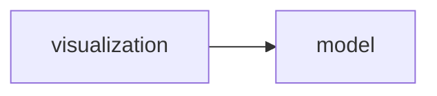
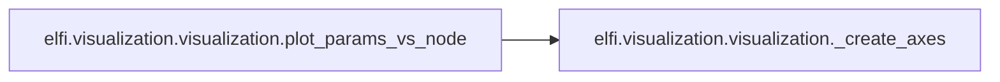
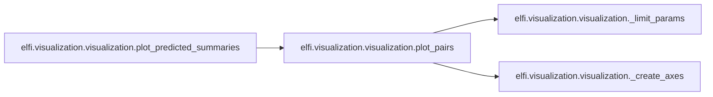
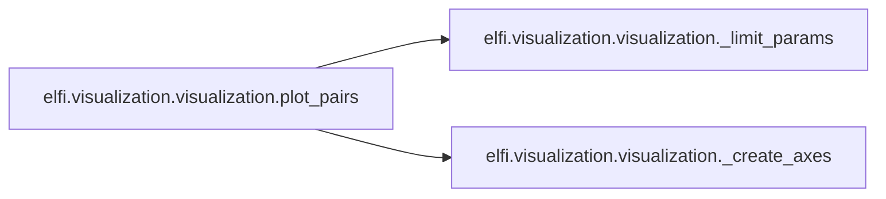

# Elfi Visualization

[_Documentation generated by Documatic_](https://www.documatic.com)

<!---Documatic-section-Codebase Structure-start--->
## Codebase Structure

<!---Documatic-block-system_architecture-start--->

<!---Documatic-block-system_architecture-end--->

# #
<!---Documatic-section-Codebase Structure-end--->

<!---Documatic-section-elfi.visualization.visualization.nx_draw-start--->
## [elfi.visualization.visualization.nx_draw](9-elfi_visualization.md#elfi.visualization.visualization.nx_draw)

<!---Documatic-section-nx_draw-start--->
<!---Documatic-block-elfi.visualization.visualization.nx_draw-start--->
<details>
	<summary><code>elfi.visualization.visualization.nx_draw</code> code snippet</summary>

```python
def nx_draw(G, internal=False, param_names=False, filename=None, format=None):
    try:
        from graphviz import Digraph
    except ImportError:
        raise ImportError('The graphviz library is required for this feature.')
    if isinstance(G, ElfiModel):
        G = G.source_net
    elif isinstance(G, NodeReference):
        G = G.model.source_net
    dot = Digraph(format=format)
    hidden = set()
    for (n, state) in G.nodes(data=True):
        if not internal and n[0] == '_' and (state['attr_dict'].get('_class') == Constant):
            hidden.add(n)
            continue
        _format = {'shape': 'circle', 'fillcolor': 'gray80', 'style': 'solid'}
        if state['attr_dict'].get('_observable'):
            _format['style'] = 'filled'
        dot.node(n, **_format)
    for (u, v, label) in G.edges(data='param', default=''):
        if not internal and u in hidden:
            continue
        label = label if param_names else ''
        dot.edge(u, v, str(label))
    if filename is not None:
        dot.render(filename)
    return dot
```
</details>
<!---Documatic-block-elfi.visualization.visualization.nx_draw-end--->
<!---Documatic-section-nx_draw-end--->

# #
<!---Documatic-section-elfi.visualization.visualization.nx_draw-end--->

<!---Documatic-section-elfi.visualization.visualization.plot_params_vs_node-start--->
## [elfi.visualization.visualization.plot_params_vs_node](9-elfi_visualization.md#elfi.visualization.visualization.plot_params_vs_node)

<!---Documatic-section-plot_params_vs_node-start--->


### Object Calls

* [elfi.visualization.visualization._create_axes](9-elfi_visualization.md#elfi.visualization.visualization._create_axes)

<!---Documatic-block-elfi.visualization.visualization.plot_params_vs_node-start--->
<details>
	<summary><code>elfi.visualization.visualization.plot_params_vs_node</code> code snippet</summary>

```python
def plot_params_vs_node(node, n_samples=100, func=None, seed=None, axes=None, **kwargs):
    model = node.model
    parameters = model.parameter_names
    node_name = node.name
    if node_name in parameters:
        outputs = [node_name]
        shape = (1, 1)
        bins = kwargs.pop('bins', 20)
    else:
        outputs = parameters + [node_name]
        n_params = len(parameters)
        ncols = n_params if n_params < 5 else 5
        ncols = kwargs.pop('ncols', ncols)
        edgecolor = kwargs.pop('edgecolor', 'none')
        dot_size = kwargs.pop('s', 20)
        shape = (1 + n_params // (ncols + 1), ncols)
    data = model.generate(batch_size=n_samples, outputs=outputs, seed=seed)
    if func is not None:
        if hasattr(func, '__name__'):
            node_name = func.__name__
        else:
            node_name = 'func'
        data[node_name] = func(data[node.name])
    if data[node_name].shape != (n_samples,):
        raise NotImplementedError('The plotted quantity must have shape ({},), was {}.'.format(n_samples, data[node_name].shape))
    (axes, kwargs) = _create_axes(axes, shape, sharey=True, **kwargs)
    axes = axes.ravel()
    if len(outputs) == 1:
        axes[0].hist(data[node_name], bins=bins, normed=True)
        axes[0].set_xlabel(node_name)
    else:
        for (idx, key) in enumerate(parameters):
            axes[idx].scatter(data[key], data[node_name], s=dot_size, edgecolor=edgecolor, **kwargs)
            axes[idx].set_xlabel(key)
        axes[0].set_ylabel(node_name)
        for idx in range(len(parameters), len(axes)):
            axes[idx].set_axis_off()
    return axes
```
</details>
<!---Documatic-block-elfi.visualization.visualization.plot_params_vs_node-end--->
<!---Documatic-section-plot_params_vs_node-end--->

# #
<!---Documatic-section-elfi.visualization.visualization.plot_params_vs_node-end--->

<!---Documatic-section-elfi.visualization.visualization.plot_predicted_summaries-start--->
## [elfi.visualization.visualization.plot_predicted_summaries](9-elfi_visualization.md#elfi.visualization.visualization.plot_predicted_summaries)

<!---Documatic-section-plot_predicted_summaries-start--->


### Object Calls

* [elfi.visualization.visualization.plot_pairs](9-elfi_visualization.md#elfi.visualization.visualization.plot_pairs)

<!---Documatic-block-elfi.visualization.visualization.plot_predicted_summaries-start--->
<details>
	<summary><code>elfi.visualization.visualization.plot_predicted_summaries</code> code snippet</summary>

```python
def plot_predicted_summaries(model=None, summary_names=None, n_samples=100, seed=None, bins=20, axes=None, add_observed=True, draw_upper_triagonal=False, **kwargs):
    dot_size = kwargs.pop('s', 8)
    samples = model.generate(batch_size=n_samples, outputs=summary_names, seed=seed)
    reference_value = model.generate(with_values=model.observed, outputs=summary_names)
    reference_value = reference_value if add_observed else None
    plot_pairs(samples, selector=None, bins=bins, axes=axes, reference_value=reference_value, s=dot_size, draw_upper_triagonal=draw_upper_triagonal)
```
</details>
<!---Documatic-block-elfi.visualization.visualization.plot_predicted_summaries-end--->
<!---Documatic-section-plot_predicted_summaries-end--->

# #
<!---Documatic-section-elfi.visualization.visualization.plot_predicted_summaries-end--->

<!---Documatic-section-elfi.visualization.visualization._create_axes-start--->
## [elfi.visualization.visualization._create_axes](9-elfi_visualization.md#elfi.visualization.visualization._create_axes)

<!---Documatic-section-_create_axes-start--->
<!---Documatic-block-elfi.visualization.visualization._create_axes-start--->
<details>
	<summary><code>elfi.visualization.visualization._create_axes</code> code snippet</summary>

```python
def _create_axes(axes, shape, **kwargs):
    fig_kwargs = {}
    kwargs['figsize'] = kwargs.get('figsize', (4 * shape[1], 4 * shape[0]))
    for k in ['figsize', 'sharex', 'sharey', 'dpi', 'num']:
        if k in kwargs.keys():
            fig_kwargs[k] = kwargs.pop(k)
    if axes is not None:
        axes = np.atleast_2d(axes)
    else:
        (fig, axes) = plt.subplots(ncols=shape[1], nrows=shape[0], **fig_kwargs)
        axes = np.reshape(axes, shape)
        fig.tight_layout(pad=2.0, h_pad=1.08, w_pad=1.08)
        fig.subplots_adjust(wspace=0.2, hspace=0.2)
    return (axes, kwargs)
```
</details>
<!---Documatic-block-elfi.visualization.visualization._create_axes-end--->
<!---Documatic-section-_create_axes-end--->

# #
<!---Documatic-section-elfi.visualization.visualization._create_axes-end--->

<!---Documatic-section-elfi.visualization.visualization.plot_pairs-start--->
## [elfi.visualization.visualization.plot_pairs](9-elfi_visualization.md#elfi.visualization.visualization.plot_pairs)

<!---Documatic-section-plot_pairs-start--->


### Object Calls

* elfi.visualization.visualization._limit_params
* [elfi.visualization.visualization._create_axes](9-elfi_visualization.md#elfi.visualization.visualization._create_axes)

<!---Documatic-block-elfi.visualization.visualization.plot_pairs-start--->
<details>
	<summary><code>elfi.visualization.visualization.plot_pairs</code> code snippet</summary>

```python
def plot_pairs(samples, selector=None, bins=20, reference_value=None, axes=None, draw_upper_triagonal=False, **kwargs):
    samples = _limit_params(samples, selector)
    shape = (len(samples), len(samples))
    edgecolor = kwargs.pop('edgecolor', 'black')
    dot_size = kwargs.pop('s', 2)
    (axes, kwargs) = _create_axes(axes, shape, **kwargs)
    for (idx_row, key_row) in enumerate(samples):
        min_samples = samples[key_row].min()
        max_samples = samples[key_row].max()
        for (idx_col, key_col) in enumerate(samples):
            if idx_row == idx_col:
                axes[idx_row, idx_col].hist(samples[key_row], bins=bins, density=True, **kwargs)
                if reference_value is not None:
                    axes[idx_row, idx_col].plot(reference_value[key_row], 0, color='red', alpha=1.0, linewidth=2, marker='X', clip_on=False, markersize=12)
                axes[idx_row, idx_col].get_yaxis().set_ticklabels([])
                axes[idx_row, idx_col].set(xlim=(min_samples, max_samples))
            elif idx_row > idx_col or draw_upper_triagonal:
                axes[idx_row, idx_col].plot(samples[key_col], samples[key_row], linestyle='', marker='o', alpha=0.6, clip_on=False, markersize=dot_size, markeredgecolor=edgecolor, **kwargs)
                if reference_value is not None:
                    axes[idx_row, idx_col].plot([samples[key_col].min(), samples[key_col].max()], [reference_value[key_row], reference_value[key_row]], color='red', alpha=0.8, linewidth=2)
                    axes[idx_row, idx_col].plot([reference_value[key_col], reference_value[key_col]], [samples[key_row].min(), samples[key_row].max()], color='red', alpha=0.8, linewidth=2)
                axes[idx_row, idx_col].axis([samples[key_col].min(), samples[key_col].max(), samples[key_row].min(), samples[key_row].max()])
            elif idx_row < idx_col:
                axes[idx_row, idx_col].axis('off')
        axes[idx_row, 0].set_ylabel(key_row)
        axes[-1, idx_row].set_xlabel(key_row)
    return axes
```
</details>
<!---Documatic-block-elfi.visualization.visualization.plot_pairs-end--->
<!---Documatic-section-plot_pairs-end--->

# #
<!---Documatic-section-elfi.visualization.visualization.plot_pairs-end--->

[_Documentation generated by Documatic_](https://www.documatic.com)